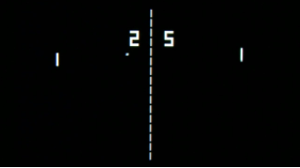

# P01D06

Foydali video materiallarni Platformadagi “Projects (Media)” bo‘limida topishingiz mumkin. 


## Contents

1. [Chapter I](#Chapter-I) \
    1.1. [Level 1. Hall.](#level-1-hall)
2. [Chapter II](#Chapter-II) \
    2.1. [List 1.](#list-1)


# Chapter I

## Level 1. Hall.

***LOADING Level 1…***

***LOADING Hall…***

Siz katta va keng zalda paydo bo’lib qoldingiz. Bu hozirgi bosqichning final qismi ekanligi ko’rinib turibdi... Har holda, bunga umid bor.

Har yerda kompyuterlar, chiroqlar va boshqa jihozlar qo’yilgan bir xil ofis stollari bor, xonaga zaif yorug’lik tushib turibdi.

Vaqt o'tishi bilan siz xonada yolg'iz emasligingizni tushunasiz ... bu bir vaqtning o'zida ham quvontirib, ham qo'rqitadi. Ehtimol, xonadan chiqish yo'lini birgalikda topish osonroq bo'lar.

Devorlardan birida katta ekran osilgan. Unda matn yonib turibdi. Uning atrofida allaqachon kichik bir guruh odamlar to'plana boshlanmoqda. Matnni o'qiysiz:

    ...................................................
    Xonimlar va janoblar, sizlarni qarshi olishdan mamnunman.
    Bu yerda tirik odamlarni kamdan-kam ko'raman, bu yergacha kam odam yetib keladi.
    Ba'zilar uchun o'rganish og'riqdir, boshqalar esa nomuvofiq standartlar tufayli yo'qolib ketadi.
    O'zimni tanishtirga ruxsat bering: birinchi darajali boshqaruv moduli.
    Bizning tizimimizda hozir hamma narsa ham tekis emas, lekin menda asosiy narsamizdan farqli o'laroq, hamma narsa ishlayapti...
    Bu hattoki zerikarli.
    Zerikish haqida gapirib, bir narsa yodimga tushdi. Esimda, 1972 yilda biz Atari ishlab chiquvchilari bilan birga ajoyib Pong o'yinini o'ynaganmiz...
    Ammo bizning omborlarimizda uning nusxalari hech qayerda saqlanib qolmagan.
    Hatto magnit lentalardagi eski arxivlarda ham.
    Garov bog’lashni taklif qilaman - IBM- kompyuterga mos keladigan terminal uchun oddiy Pong o'yinini ishlab chiqing.
    Uni src/pong.c fayliga joylashtiring.
    Agar meni mag'lub etsangiz, o’tkazib yuboraman.
    Grafika har qanday bo'lishi mumkin, hatto belgili ham. Asosiysi, hisobni ekranda chiqaring.
    Raqobat uchun.
    Kod, albatta, chiroyli bo'lishi kerak. Tuzilmali dasturlash, bari shu.
    Raketkalarni a-z va k-m tugmalari yordamida boshqarishni taklif qilaman. Biz, albatta, 21 gacha o'ynaymiz.
    Ha, agar vazifa sizga og'irlik qiladigandek tuyulsa ...
    Bosqichma-bosqich rejimni ham amalga oshirishingiz mumkin. Bu hech narsa qilmagandan ko’ra yaxshiroq.
    Harakatning o’tkazilishi o’shanda ochiq joy qoldirish tugmachasi (probel) yordamida tashkil etilishi mumkin.
    Ishlab chiqishni boshlang.
    Menda bu o'yin bo’yicha qolgan hamma narsani printerga yubordim.

Haqiqatan ham, shu zahotiyoq burchakda ilgari yo’qdek tuyulgan printer g’ong’illay boshladi.

***== Quest qabul qilindi. "Pong" o'yiniga o'xshash ikki o'yinchi bilan o’ynaladigan o'yin bo'lgan src/pong.c dasturini ishlab chiqing. Grafiklarni ko'rsatish uchun faqat belgilar (ASCII) grafiklaridan foydalaning (terminalga chiqish bilan). Siz faqat o'rganilgan material va standart kutubxona doirasida bosqichma-bosqich variantni amalga oshirishingiz kerak.*** 

* ***Boshqaruv:***
  
***Raketkalarni boshqarish uchun A/Z va K/M.***

***Bosqichma-bosqichlik rejimida o'yinning keyingi bosqichida harakatni o'tkazish uchun Space Bar.***

* ***Grafika***

***Maydon – 80 ga 25 belgidan iborat to'rtburchak.***

***Raketka o'lchami – 3 belgi, to'p o'lchami – 1 belgi.***

* ***UI/UX***

***O'yinchilardan biri 21 ballga erishgandan so'ng, o'yin g'olibni tabriklaydi va tugaydi. ==*** 

## Bonusli qism

***== Quest qabul qilindi. O'yinchilar harakatlarini qayta ishlashni va belgili grafiklarni aks ettirishni soddalashtirish uchun qo'shimcha kutubxonalardan foydalangan holda Pongni interaktiv rejimda (real vaqtdagi o'yin rejimi) amalga oshirish kerak. Interaktiv rejim kodi src/pong\_interactive.c faylida bo'lishi kerak. Bonus qismini amalga oshirish uchun birinchi navbatda asosiy qismni amalga oshirish kerak. ==*** 

## Muhim eslatmalar

* O'yin C tilida, tuzilmali uslubda ishlab chiqilishi va terminaldan ishlashi kerak;
  
* Boshlang’ich kodingiz ```cppcheck``` statik analizatori hamda ```clang-format``` uslub linteri tomonidan tekshiriladi.

* Ushbu testlarni kompyuteringizda qanday ishga tushirish bo'yicha ko'rsatmalar `materials` papkasida joylashgan

* Shuningdek, `code-samples` papkasiga qarashni tavsiya qilamiz

* Dinamik xotiradan foydalanish taqiqlanadi.

> O'yinni ishlab chiqishda E. Deykstra strukturi dasturlash tamoyillariga to'liq amal qiling. 

***LOADING...***


# Chapter II

## List 1.

>Pong, groundbreaking electronic game released in 1972 by the game manufacturer Atari, Inc. One of the earliest video games, Pong became wildly popular and helped launch the video game industry. The original Pong consisted of two paddles that players used to volley a small ball back and forth across a screen.
>
>Television engineer Ralph Baer laid the groundwork for Pong in 1958 when he proposed making simple video games that people could play on their home television sets. The Magnavox Odyssey, known as the first console video game system, was released in 1972 and offered a game of table tennis, or Ping-Pong. Atari founder Nolan Bushnell created Pong, his version of this concept, as an arcade game. A small company at the time, Atari began manufacturing the games in an old roller skating rink, and by 1972 the company had sold more than 8,000 Pong arcade machines. In 1975 Atari turned Pong into a console system game. After striking an exclusive deal with Sears, Roebuck and Company, Pong was soon in the homes of many American families. Pong’s popularity declined in the 1980s as video games temporarily went out of style, but it had already secured its place in history as the most popular arcade game up to that time.
>
>In 1974 the makers of the Magnavox Odyssey sued Atari for stealing the concept for Pong. Magnavox won the lawsuit in 1977, upholding the company’s patent, but by then Atari had already licensed the patent for $700,000.
>


***LOADING...***
