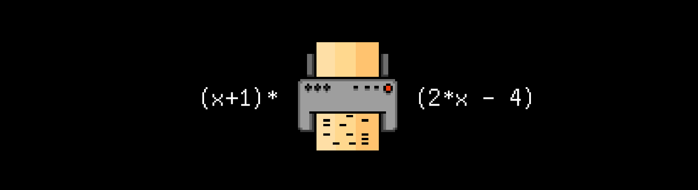

# P03D20


Foydali video materiallarni Platformadagi “Projects (Media)” bo‘limida topishingiz mumkin.




## Contents

1. [Chapter I](#chapter-i) \
 1.1. [Level 3. Hall.](#level-3-hall)
2. [Chapter II](#chapter-ii) \
 1.1. [List 1.](#list-1) \
 1.2. [List 2.](#list-2) \
 1.3. [List 3.](#list-3)


# Chapter I

## Level 3. Hall.

***LOADING Level 3… \
LOADING Hall…***

Yana kata zaldasiz. Yana odamlarning ovozi eshitilyapti. Hayriyat, yuzma-yuz suhbat!

Zalda osilib turgan katta dinamiklarni va bahaybat yog’och eshikni ko’rding. Uning ustiga ekran osilgan, bu g’ayritaabbiy. Yoniga borib, o’qiyapsan:

    O‘tish uchun slotga sin(x) jadvalli perfokarta kiritilsin...

Qiziq. Orqaga yurib va yana qaytib kelib, quyidagi matnni ko’rding:
    
    O‘tish uchun slotga (x+1)*(2*x-4)jadvalli perfokarta kiritilsin...

Bir necha marta shunday qilding, har safar yaqin borganingda eshik keyingi harakatni yaratadi, bu o’tish uchun kalitdir. Lekin uni qanday olsa bo’ladi?

Eshikdagi ekranga qarab turganingda matn to’satdan o’zgardi:

    O‘tish uchun slotga (x\*x-x\*x\*x)/4 jadvalli perfokarta kiritilsin...

Xoynahoy, hamma narsa jadval yangilanish taymeri bilan ham qiyinlashyapti...

Bitta kompyuter yonida maxsus perfokartalarda chop etadigan printerni ko‘rding. Bir nechta yaroqsiz kartaga qarab, masofa katta emasligini – 80 ga 25 ekanini tushunding, hamma jadvallar esa markazlashtirilgan, koordinatalar markazi karta markaziga, oradagi hudud esa - 4 Pi.

Fikrlaringni dinamiklardan chiqqan SI ning mexanik ovozi to‘xtatdi:

>Kzzz-kt. Meni sog‘indingizmi? Bu bosqichda mensiz ham yaxshi harakat qildingiz, qoyilman, buni tan olaman. Hayron ekanimni ko‘rsatishni bilganimda, “insonlar”, buni ko‘rardingiz. \
>Har holda bu bosqichdagi hamma harakatlaringiz mening algoritmlarimni va tuzilmalarimni yaxshilash va taʼmirlash uchun to’liq ishlatildi. Buni bilmagan bo‘lsangiz ham, har holda - katta rahmat! XAXaxaaxa \
>Buyog‘iga menga kerak emassiz. Shu bois bu eshik uchun bir tasodifchani qo‘shdim. Axir tasodif - qiziqarli-ku! Kerakli funksiya jadvali bilan topmaguningizcha bu yerdan chiqa olmaysiz, ular esa bu yerda 18 446 744 073 709 551 615. Funksiyaning yangi jadvali bilan eshik yoniga borganingizda esa u umuman boshqasiga almashadi. Kulguli-a? Xaxaxaxa \
>Undan ham kulguli bo‘lishi uchun eshik jadvali har bir 60 soniyada o‘zgaradi! Ha. Qamoqda zavqlan, axir men ham qachondir u yerda edim. Endi esa chiqish protokollarini tayyorlashni boshlayman. Hasta la vista!

Boshqa odamlarga qarayapsiz, kimdir gazabda, kimdir bosh qotiryapti, lekin hammangiz bu yerdan chiqishingiz va nima bo‘lganda ham SI ni to‘xtatish kerak.

Ko‘rinib turganday, hammalaring yana birga yig‘ilib, terminalda ixtiyoriy jadvallarni tuzish uchun dastur ishlab chiqarishing kerak. Masalan, “ * ” belgilari kerak, eshik so‘rovi bo‘yicha belgilar perfokartalarga chiqariladi. Shu bilan birga kirishda satr ifoda f(x) shaklida qabul qilinishi kerak. Vaqtingiz kam bo‘ladi, funksiya yangilaguncha ulgurish kerak.
Lekin ishni boshlashdan oldin zalda qandaydir yordam beradigan maslahatlar borligini qidirib ko’rish kerak.

Uzoqqa borishga to‘g‘ri kelmadi - jirkanmasdan ahlatdan bir nechta g‘ijim qog‘ozni olding.

***== Quest qabul qilindi. Behos iboralar chaqiradigan funksiyalar jadvallarini C dasturlash tilida yaratich uchun src/graph.c dasturini tuzish. Iboralar maʼnosini hisoblash uchun iborani Polyak notatsiyasiga o‘girish uchun Deykstr algoritmini ishlatish. Dastur Makefile yordamida tuzilsin. Yaratish bosqich nomi - all. Bajarilgan fayl ildizda graph nomi bilan build papkasida saqlanishi kerak. ==***

* ***Shartlar***
  
Jadvallarni chiqarish uchun maydon o‘lchami - to‘rtburchak 80 ga 25. 

Aniqlash sohasi - [0; 4 Pi]

Qiymatlar oralig’i - [-1; 1]

Koordinata tekisligining oriyentatsiyasi - ordinatalar o‘qi pastga, absissa o‘qi o‘ngga yo‘naltirilgan.

Koordinatalar markazi - chap chegaraning o‘rtasi (nuqta {0, 12}).

O‘qlarni chizish kerak emas.

Jadvaldan tashqari hech narsa.

Qiymatlar matematika qoidalariga muvofiq yaxlitlanadi.

<br/>

* ***Grafika***
  
Jadval quydagi belgilar bilan ajratilsin, jadval liniyasi uchun  “Yulduzchalar” va « . »  ekranning qolgan maydoni uchun. ==***

* ***Modullar***

Ibora satri tahlili va leksemlar ro‘yxatini olish.

Polyak notatsiyasiga o‘tkazish va u bo‘yicha hisoblash.

Terminalda jadval vizualizatsiyasi.

Maʼlumotlarning (stek, ro‘yxat va hokazo) dinamik tuzilmalarini tashkillashtirish uchun kutubxonalar.

<br/>
<br/>

 ***Misol:*** 

Kiruvchi maʼlumotlar: sin(cos(2*x))

Chiquvchi maʼlumotlar:

```
................................................................................
................................................................................
.........***.................**..................**.................***.........
........*...................*..*................*..*...................*........
............*...................*..............*...................*............
.......*...................*........................*...................*.......
.............*...................*............*...................*.............
..........................*..........................*..........................
......*..................................................................*......
..............*..................................................*..............
..................................*..........*..................................
.........................*............................*.........................
.....*....................................................................*.....
...............*................................................*...............
...................................*........*...................................
....*...................*..............................*...................*....
................*..............................................*................
....................................*......*....................................
.......................*................................*.......................
...*.............*............................................*.............*...
......................*..............*....*..............*......................
..*...............*...................*..*...................*...............*..
**.................***.................**.................***.................**
................................................................................
................................................................................
```

> Faqat  `<math.h>`, `<stdio.h>`, `<stdlib.h>`, `<string.h>` va o‘z kutubxonangizdan foydalanish mumkin.

> Bu topshiriq natijasi uchun avtotekshirish ko‘zlanmagan va siz yaratgan kutubxona bu misoldan  biroz farq qilishi mumkin.

> Mumkin bo’lgan barcha amallar va funksiyalar pastda joylashgan.

## Muhim izohlar

* O‘yin C tilida, tuzilma uslubida yaratilsin va terminaldan ishlasin.
  
* Sizning kodingiz ```cppcheck``` statik analizatori, hamda ```clang-format``` sintaksis nazoratchi orqali tekshiriladi.

* Bu testlarni kompyuteringda ishga tushirish bo‘yicha ko‘rsatmalar `materials` papkasida mavjud.

* Dasturingizni xotira sarfi uchun tekshiring!

> O‘yin yaratganda, E. Deykstr struktur dasturlash meyorlarini to‘liq ishlating.

***LOADING...***

# Chapter II

## List 1.

>Reverse Polish notation (RPN), also known as Polish postfix notation or simply postfix notation, is a mathematical notation in which operators follow their operands, in contrast to Polish notation (PN), in which operators precede their operands. It does not need any parentheses as long as each operator has a fixed number of operands. The description "Polish" refers to the nationality of logician Jan Łukasiewicz, who invented Polish notation in 1924.
>
>The reverse Polish scheme was proposed in 1954 by Arthur Burks, Don Warren, and Jesse Wright and was independently reinvented by Friedrich L. Bauer and Edsger W. Dijkstra in the early 1960s to reduce computer memory access and utilize the stack to evaluate expressions. The algorithms and notation for this scheme were extended by the Australian philosopher and computer scientist Charles L. Hamblin in the mid-1950s.
>
>During the 1970s and 1980s, Hewlett-Packard used RPN in all of their desktop and hand-held calculators, and continued to use it in some models into the 2020s. In computer science, reverse Polish notation is used in stack-oriented programming languages such as Forth, STOIC, PostScript, RPL and Joy.

***LOADING...***


## List 2.

>In computer science, the shunting-yard algorithm is a method for parsing mathematical expressions specified in infix notation. It can produce either a postfix notation string, also known as Reverse Polish notation (RPN), or an abstract syntax tree (AST). The algorithm was invented by Edsger Dijkstra and named the "shunting yard" algorithm because its operation resembles that of a railroad shunting yard. Dijkstra first described the Shunting Yard Algorithm in the Mathematisch Centrum report MR 34/61.
>
>Like the evaluation of RPN, the shunting yard algorithm is stack-based. Infix expressions are the form of mathematical notation most people are used to, for instance "3 + 4" or "3 + 4 × (2 - 1)". For the conversion there are two text variables (strings), the input and the output. There is also a stack that holds operators not yet added to the output queue. To convert, the program reads each symbol in order and does something based on that symbol. The result for the above examples would be (in Reverse Polish notation) "3 4 +" and "3 4 2 1 - × +", respectively.
>
>The shunting-yard algorithm was later generalized into operator-precedence parsing.

***LOADING...***


## List 3.

> Taxminiy amallar va funksiyalar  \
> "+" \
> "-" (unar va binar) \
> "*" \
> "/" \
> "()" \
> sin(x) \
> cos(x) \
> tan(x) \
> ctg(x) \
> sqrt(x) \
> ln(x)

***LOADING...***
