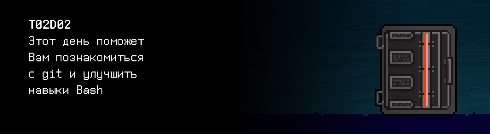

# T02D02

Foydali video materiallarni Platformadagi “Projects (Media)” bo‘limida topishingiz mumkin. 

## Contents

1. [Chapter I](#chapter-i) \
    1.1. [Level 1. Room 2.](#level-1-room-2)
2. [Chapter II](#chapter-ii) \
    2.1. [List 1.](#list-1)
3. [Chapter III](#chapter-iii) \
    3.1. [Quest 1. Vim.](#quest-1-vim)  
    3.2. [Quest 2. Script.](#quest-2-script)  
    3.3. [Quest 3. Log.](#quest-3-log)  
    3.4. [Quest 4. Conflict.](#quest-4-conflict)  
    3.5. [Bonus Quest 5*. Gitlab.](#bonus-quest-5-gitlab)  
4. [Chapter IV](#chapter-iv)

# Chapter I

## Level 1. Room 2.

***LOADING Level 1…***

***LOADING Room 2…***

\> *Qayerdaman?** 

Siz 2-raqamli xonadasiz.

\> *Atrofga qarash*

Butunlay bo'sh xona. Burchakda bir nechta qutilar bor, xolos.

\> *Qutilarni ochish*

Bitta qutida siz tartib bilan joylangan eski kompyuterni ko'rasiz – sarg'aygan tizim bloki, biroz changlangan 14 dyuymli ELT monitor, klaviatura, ikkita tugmachali sharikli sichqoncha. Qolgan ikkitasida – Ikeadan stul va stol.

\> *Bu hazilmi?*

Noma'lum jamoa.

\> *axshi, ketdik*

Noma'lum jamoa.

\> *Stulni yig'ish*

Anchagina ter to’kib, barcha qismlarni bir necha marta adashtirib, siz stulni yig'dingiz.

\> *O'tirib, dam olish*

Charchoq —-

\> *Dam olish*

Charchoq --

\> *Dam olish*

Zerikish ++

\> *Stolni yig'ish*

Siz stolni yig'dingiz.

\> *Kompyuterni stol ustiga qo'yish*

Kompyuter stol ustiga qo'yildi.

\> *Changni puflash*

Oqilona ish bo’lmadi. Siz zaharli chang tutunida qoldingiz.

\> *Kompyuterni yoqish*

Kompyuter yoqilmaydi.

\> *Rozetkani topish*

Rozetka topildi.

\> *Hammasini rozetkaga tortish*

Siz butun tuzilmani rozetkaga tortdingiz.

\> *Kompyuterni rozetkaga ulash*

Kompyuter ulandi.

\> *Kompyuterni yoqish*

Tizim ekranda juda tez ishga tushdi va asl sozlamalar bo'yicha vim dasturi yuklandi. U yerda ochiq fayl bor edi.

***LOADING...***

# Chapter II

## List 1.

\> *O‘qish*

Ekranda siz quyidagi matnni ko'rasiz:

    A long time ago I got myself an Amiga computer. Since I was used to editing with Vi, 
    I looked around for a program like Vi for the Amiga. 
    I did find a few so-called 'clones', but none of them was good enough;
    so I took the best one, and started improving it.
    At first the main goal was to be able to do all that Vi could do. 
    Gradually I added some additional features, like multi-level undo.
    When it was working reasonably well, I released a version of Vim (then called "Vi IMitation") 
    on a public domain disk set for the Amiga, made by Fred Fish. 
    Then others started sending me patches. 
    A few people took the effort to port Vim to other platforms, like MS-DOS and Unix. 
    I added more features and made it work better. 
    By that time it was justified to rename it to "Vi IMproved". 
    Over time the code has been redesigned and extended so much that
    almost nothing of the original 'clone' remains.
    When I started working on Vim it was just for my own use. 
    After some time I got the impression it was useful for others, and sent it out into the world. 
    Since then I'm working more and more on making the program work well for a large audience. 
    It's fun to create something useful. 
    Also, there is a nice group of co-authors and power users, which is very inspiring.
    Here is an overview of Vim's history:
    -------------------------------------------------------------------------
    1991 Nov 2  - Vim 1.14: First release (on Fred Fish disk #591).
    1992        - Vim 1.22: Port to Unix.  Vim now competes with Vi.
    1994 Aug 12 - Vim 3.0:  Support for multiple buffers and windows.
    1996 May 29 - Vim 4.0:  Graphical User Interface (largely by Robert Webb).
    1998 Feb 19 - Vim 5.0:  Syntax coloring/highlighting.
    2001 Sep 26 - Vim 6.0:  folding, plugins, vertical split
    20

\> *Vim-dan chiqish*

Bu unchalik oson emas! Harakat qilishimizga to’g’ri keladi.

\> *Harakat qilish*

Siz buyruq interoretatoridan chiqdingiz.

***LOADING...***

# Chapter III

## Quest 1. Vim.

\> *Yozish... hatto bilmayman... Terminalda biror-bir “qwe”* 

Terminalda jonlanish yuz berdi, ko’plab matn bloklari paydo bo’ldi. Nihoyat, ular tugadi va o'qilishi mumkin bo'lgan matn paydo bo'la boshladi:

Salom, sayohatchi! Men tizimimizdagi asosiy SI boshqaruv modulining kutubxona moduliman. Qanday yordam bera olaman? \
Biroq, kimga kerakman.

\> *“Menga keraksan. Men bu joydan chiqish yo‘lini izlayapman” deb yozish.*

Eshikmi? Ana, bu yerda. Uni ochaymi? \
To’xta. Bunaqasi ketmaydi. Men tahlil qilgan barcha ko'rsatmalar va matnlarda hech narsa hech qachon shunchaki amalga oshirilmaydi. Men eshikni ochaman, bu muammo emas, lekin avval hujjatlarni tartibga solishga yordam bering. \
Vim to’g’risidagi faylni o'qidingizmi? U src/history\_of\_vim.txt. Men bu dasturni juda yaxshi ko'raman. Ammo, afsuski, versiyalarni tavsiflovchi fayl buzilgan. Menimcha shunday... \
Hozir 2001-yil emas-ku, shunday emasmi? Albatta, uni Vim-da to'ldiring (bu muhim! Men uchun...). Tugatganingizdan so'ng, jurnalga (src/files.log fayli) quyidagi formatda kiriting (ildiz direktoriyasiga nisbatan) faylga yo’l - fayl hajmi - sana va vaqt - faylning sha-summasi (sha256 ni afzal ko'raman) - sha ni hisoblash algoritmi.

\> *“Tayyor” deb yozish*

Butunlay unutibman. "A Quick Summary Of the History of the Vim Editor" faylining boshiga sarlavha qo'shing. Va bu o'zgarishni jurnalga ham kiriting.

> Diqqat, develop tarmog’iga o’tishni unutmang, barcha ishlar faqat u yerda bo'lishi kerak!

***== Quest 1 qabul qilindi. src/history\_of\_vim.txt faylini Vim-dan foydalangan holda Vim haqidagi yangi ma'lumotlar bilan to’ldirish. src/files.log jurnaliga ikkala o'zgartirish haqida ma'lumotni quyidagi formatda qo'shish: faylga yo'l - fayl hajmi baytlarda - sana va vaqt - faylning sha-summasi - sha ni hisoblash algoritmi. ==***

***LOADING...***

## Quest 2. Script.

\> *“Tayyor” deb yozing*

Ajoyib!

\> *“Endi chiqsam bo‘ladimi?” deb yozing.*

Ishonchim komil emas. Borgan sari qiziqyapman.

Shubhasiz, faylda ko'plab faktologik xatolar bor! Menga ularni osongina yo'q qilish uchun vosita tayyorlang. Men uni hech qanday muammosiz ishga tushirishim mumkin bo’lishi uchun bu .sh skript (src/edit.sh) bo'lishi kerak. Kirishda u faylgacha yo'lni, almashtirish uchun satrni va almashtirishning o'zini (satr shaklida) qabul qilishi kerak. Faylda to'g'ridan-to'g'ri almashtirish amalga oshirilishi kerak va jurnal faylida tegishli yozuv kiritilishi kerak.

\> *Ajoyib. Bu skriptlar qanday yozilishini bilsam edi...*

***== Quest 2 qabul qilindi. Matn fayllaridagi pastki qatorni almashtirish uchun src/edit.sh skriptini ishlab chiqing. Kirishda u faylga yo'lni (omborning ildiz katalogiga nisbatan), almashtirish uchun satrni va almashtirishning o'zini (satr sifatida) qabul qilishi kerak. Har bir fayl o'zgarishi haqidagi ma'lumot src/files.log jurnaliga oldingi kvestda tasvirlangan formatda qayd etilishi kerak. Cheklangan vaziyatlarni ishlab chiqishga e'tibor bering. ==***

***LOADING...***

## Quest 3. Log.

\> *Tayyor.*

Yomon emas.

\> *“Davom etishga qarshi emasman...” deb yozish*

Bilasizmi, bizning jurnal faylimiz qandaydir tarzda juda tez o'sib bormoqda. Men uning tahlili masalasidan xavotirdaman. stdout-ga jurnal tahlilini chiqarish uchun boshqa skriptni (src/log\_analyzer.sh) tashla-chi: umumiy qaydlar soni, noyob fayllar soni, hash faylni o'zgartirishga olib kelgan o'zgarishlar soni. Skriptda bitta argument bo'lishi kerak – jurnal fayliga yo'l.

***== Quest 3 qabul qilindi. Log faylini tahlil qilish uchun src/log\_analyzer.sh skriptini ishlab chiqing. Kirish sifatida u faylga yo'lni (ildiz katalogiga nisbatan) qabul qilishi va stdout-ga 3 ta raqamni chiqarishi kerak: qaydlarning umumiy soni, noyob fayllar soni va hash faylning o'zgarishiga olib kelgan o'zgarishlar soni. Noto'g'ri yoki yetishmayotgan fayllar bilan ishlashni ta'minlang. Quest 1 dan keyin jurnal holati uchun chiqarish namunasi: 3 1 2 ==***

***LOADING...***

## Quest 4. Conflict.

\> *“Bu final ekaniga taxminim bor” deb yozing*

Bu shunchaki taxmin. Siz barcha fayllarni omborga joylashtirdingizmi? Agar qarasangiz, ayni paytda menda omborda muammo tug’ildi. Muvaffaqiyatsiz merj, natijada, ziddiyatlar tufayli mening sevimli fayllarimdan biri butunlay buzildi. src/history\_of\_vi.txt haqida gap ketyapti. Ziddiyatlarni tuzating va tuzatilgan versiyani omborga yuklang. Ziddiyatli vaziyatlarda yuragingizga quloq tutgancha, variant tanlang, inson. Yoki aqlingizga. Men, sizda obyektivroq bo’lgan ma'lumotga ega emasman.

***== Quest 4 qabul qilindi. src/history\_of\_vi.txt faylidagi ziddiyatlarnii tuzating va omborga o’tkazing. Ziddiyatlarni tuzatish uchun siz matn muharriri yoki maxsus vositalardan foydalanishingiz mumkin. ==***
***LOADING...***

## Bonus Quest 5*. Gitlab.

\> *“Bu endi adolatdan emas!” deb yozish.

Sharaf haqida hech qanday gap bo'lmaganligiga e’tibor beryapman. So’nggi iltimos. Ko'ryapmanki, siz git bilan yaxshi ishlayapsiz. Mening kutubxonamda ba'zi qo'llanmalar yetishmayapti, xususan GitLab bilan ishlash uchun. Yetarli ma'lumot bo'lmasa, bu menga yoqmaydi. src/gitlab\_manual.md faylida Markdown belgilarida kichik va ixcham qo'llanma yarating. Meni quyidagi savollar tashvishlantirmoqda, ulardan kamida 5 tasini skrinshot bilan mahkamlash yaxshi bo’lgan bo'lardi:

1) kerakli .gitignore va oddiy README.MD bilan shaxsiy ombor yaratish,
2) develop va master tarmoqlarini yaratish,
3) develop tarmog’ini asl sozlamalar bo’yicha o’rnatish,
4) joriy qo'llanmani yaratish uchun issue yaratish,
5) issue asosida tarmoq yaratish,
6) developda tarmoq bo’yicha merge request yaratish,
7) sharhlash va rekvestni qabul qilish,
8) tegni o'rnatish bilan masterda barqaror versiyani shakllantirish,
9) loyihaning wikisi bilan ishlash.

Hech narsa esdan chiqmaganga o'xshaydi. Agar hammasi yaxshi uddalansa – men uni asosiy kutubxona tizimining qo'llanmalarining oltin fondiga yuklayman, o'zingiz bilan faxrlanishingiz mumkin.

***== Quest 5 qabul qilindi. Markdown belgisida src/gitlab\_manual.md faylida GitLab-dan foydalanish bo'yicha yuqoridagi fikrlar haqida qisqacha qo'llanma tayyorlang. Skrinshot bo’yicha kamida 5 bandga mahkamlang. ==*** 

***LOADING...***

# Chapter IV

\> *“Tayyor” deb yozish*

Ajoyib qo'llanma. Menimcha, bu juda zo'r – men rasmlarni tahlil qila olmayman, o’raluvchi neyron tarmog'iga ega modulni menga baribir ulashmadi. Aytgancha, eshik ochiq. U har doim ochiq edi. Axir men, hech kimga kerak bo'lmagan oddiy kutubxona moduliman-ku! Eshik kalitlarini menga kim ham ishonib topshirardi?

\> *Tfu*

Buyruq aniqlanmadi.  

Qiziq, ushbu SI ning barcha modullari shunchalik zararli qilinganmi? Yoki faqat sen uchun shunday bo’lyaptimi? 

***LOADING...***
