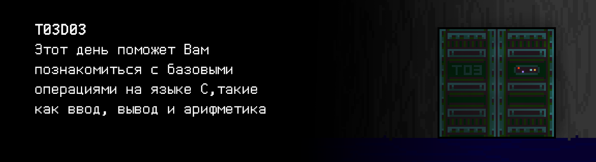

# T03D03

Foydali video materiallarni Platformadagi “Projects (Media)” bo‘limida topishingiz mumkin. 

## Contents

1. [Chapter I](#chapter-i) \
    1.1. [Level 1. Room 3.](#level-1-room-3)
2. [Chapter II](#chapter-ii) \
    2.1. [List 1.](#list-1) \
    2.2. [List 2.](#list-2) \
    2.3. [List 3.](#list-3) \
    2.4. [List 4.](#list-4) 
3. [Chapter III](#chapter-iii) \
    3.1. [Quest 1. Introducing.](#quest-1-introducing)  
    3.2. [Quest 2. Not my name.](#quest-2-not-my-name)  
    3.3. [Quest 3. Arithmetic test.](#quest-3-arithmetic-test)  
    3.4. [Quest 4. Who is Max.](#quest-4-who-is-max)  
    3.5. [Quest 5. Complex calculations.](#quest-5-complex-calculations)  
    3.6. [Quest 6. Be careful with the floating.](#quest-6-be-careful-with-the-floating)  
    3.7. [Quest 7. Lock picking.](#quest-7-lock-picking)  
4. [Chapter IV](#chapter-iv)  

# Chapter I

## Level 1. Room 3.

***LOADING Level 1…***

***LOADING Room 3…***

\> *Atrofga qarash*

Stol va kompyuter bu safar to'liq yig'ib qo’yilgan. Monitor ekrani yoqilgan va terminalning qorong'i fonida miltillovchi kursor sizni buyruq kiritishga taklif qiladi.

\> *Eshikni tortish*

Bugun ham u yopiq. Afsus.

\> *O‘tirish*

Stulning sekin g’ichirlashi butun xonada aks-sado berdi.

\> *Ekranga qarash*

Monitor ekranini diqqat bilan ko'rib chiqsangiz, terminalda miltillovchi kursordan tashqari "KERAK EMAS" so'zi yozilganligini sezasiz.
Qandaydir be’manilik, deb o’ylaysiz siz.

\> *Stolga qarash*

Hammasi odatdagidek. Biroq, klaviatura biroz notekis turibdi.

\> *Klaviaturani ko'tarish*

Klaviatura ostida siz bir nechta g'ijimlangan, eski qog'oz varaqlarini ko'rasiz. Ular bir necha asr davomida shu yerda yotgandek ko’rinishda. Qog'oz ancha sarg'ayib qolgan, qirralari esa yemirila boshlagan.

\> *Qog’ozlarni o'qish*

***LOADING…***

# Chapter II

## List 1.

C dasturlash tili 1973 yilda AT&T Bell Laboratories xodimi Dennis Ritchi tomonidan UNIX operatsion tizimini ishlab chiqish uchun yuqori darajadagi dasturlash tili sifatida yaratilgan. Biroq, keyinchalik u boshqa ko'plab platformalarga ko'chirildi. C tili protsedurali (strukturali) dasturlash tilidir - C dasturi protseduralar yoki funksiyalar to'plamidan iborat. Ushbu protseduralar va funksiyalar turli xil ko'rsatmalarni o'z ichiga oladi: bildirishnomalar, operatorlar va boshqa elementlar, ular birgalikda hisoblash tizimining algoritmini tavsiflaydi. Dasturning kirish nuqtasi nomi – main (asosiy funksiya). U rasmiy parametrlarga ega bo'lmasligi yoki buyruq qatori ma'lumotlarini qabul qilishi mumkin. Funksiyalar tanasi tarkibiy ko'rsatma sifatida tasvirlanadi va figurali qavslar ({}) ichiga olinadi. C dastur kodida foydalanishdan oldin e'lon qilinishi kerak bo'lgan o'zgaruvchilar bilan ishlaydi. Barcha oddiy C tili ko’rsatmalari nuqtali vergul bilan tugaydi. Nuqtali vergulga ega bo’lgan har qanday ifoda ko’rsatma yaratadi. \
ISHONISH \
Izohlar « /* » bilan boshlanib, « */ » bilan tugaydi va bir nechta satrlarni egallashi mumkin. « // ». belgilari bilan boshlanadigan bir qatorli izohlar ham mavjud. Izohlar hech qanday foydali ish bajarmaydi – ular ishlab chiquvchilarga kodni tushunishlarini osonlashtirish uchun kerak. Ularga berilib ketmaslik kerak – eng yaxshi kod – sharhlarsiz o'zi uchun gapiradigan koddir.
...

\> *Ikkinchi varaqni oling*

***LOADING…***

## List 2.

>Date: Sun, 22 Mar 87 10:56:56 EST
>From: rms (Richard M. Stallman)
>
>The GNU C compiler is now available for ftp from the file
>/u2/emacs/gcc.tar on prep.ai.mit.edu. This includes machine
>descriptions for vax and sun, 60 pages of documentation on writing
>machine descriptions (internals.texinfo, internals.dvi and Info
>file internals).
>
>This also contains the ANSI standard (Nov 86) C preprocessor and 30
>pages of reference manual for it.
>
>This compiler compiles itself correctly on the 68020 and did so
>recently on the vax.  It recently compiled Emacs correctly on the
>68020, and has also compiled tex-in-C and Kyoto Common Lisp.
>However, it probably still has numerous bugs that I hope you will
>find for me.
>
>I will be away for a month, so bugs reported now will not be
>handled until then.
>
>If you can't ftp, you can order a compiler beta-test tape from the
>Free Software Foundation for $150 (plus 5% sales tax in
>Massachusetts, or plus $15 overseas if you want air mail).
>
>Free Software Foundation
>1000 Mass Ave

\> *Keyingi varaqni oling*

***LOADING…***

## List 3.

>Памятка git:
>- git clone — Ish boshida.
>- git commit — O'zgarishlar qo'shilganda. Kommit uchun tushunarli nom qo'shishni unutmang.
>- git push origin — o'zgarishlarni masofaviy serverga saqlash uchun.
>- git status — Omborning joriy holati..
>- Obyektli va bajariladigan fayllarni omborga tortmang! Hech qachon!
>- Har doim tarmoqlarda ishlang. Ishlash uchun develop tarmog’idan foydalaning.

\> *Keyingi varaqni olish*

***LOADING…***

## List 4.

>**QO’LLANMA (ESHIK):**
>- Git bo’yicha qo’llanma chap cho'ntagingizda, buni unutmang!
>- SI ga kirish uchun ai modulini ishga tushiring.
>- O'ng cho'ntagingizda uslublar bo'yicha qo'llanma, adashtirmang! SI uslublarga qaratilgan, ularga amal qilishni unutmang!
>- Batafsil ma'lumotni... biror-bir joyda topasiz.
>- Bu narsa eshiklarni boshqaradi. Uni g'azablantirmaslikka harakat qiling. Modul hali to'liq sozlanmagan.
>- Stulni burang!

Ko'rinishidan, siz bu xonadagi birinchi tashrif buyuruvchi emassiz. Kimdir boshqa qo’llanmalarni unutmaslik uchun o'ziga qo’llanma yozishni unutgan. Hech bo'lmaganda eshikni ochish uchun kimga murojaat qilish kerakligi aniq. Biz uni ushbu SI ni ochishga ko'ndirishimiz kerak. Yoki uning modullaridan birini.

***LOADING…***

# Chapter III

## Quest 1. Introducing.

Terminalda ochilgan katalogga qarab, siz qo’llanmada ko'rsatilganidek, SI modulini topasiz.

\> *ai ni ishga tushiring*

    Modullar ishga tushirilmoqda... ... ... Ogohlantirish
    Interaktiv qobiq ishga tushirilmoqda... ... ... Ogohlantirish
    Modullar tekshirilmoqda... ... ... Ogohlantirish
    GCC ishga tushirilmoqda
    Ogohlantirish: Ishning to‘g‘ri davom etishi uchun src/hello.c... taqdimot moduli topilmadi.
    Taqdimot modulini qo'shing!

Joriy katalogdagi qolgan fayllarni ko'rib chiqqandan so'ng, omborga e'tibor berish kerakligini tushunasiz. Biroq, omborning src papkasida siz ushbu taqdimot moduliga o'xshash narsani topa olmaysiz. Ko'rinib turibdiki, buni o'zingiz yozishingiz kerak bo'ladi. \
Katalogni ko'rib chiqayotib, siz deyarli barcha SI kodi C11 standartida gcc kompilyatori va standart kutubxona yordamida C tilida yozilganligini payqadingiz. Ko'rinib turibdiki, moslikni saqlash uchun ushbu qoidaga rioya qilish kerak. \ 
Siz ishlab chiqqan taqdimot moduli terminal ekranida salomlashish xabarini ko'rsatishi kerak. 
Bu shunday bo'laqolsin: "Hello, AI!" Yaratilgan modul kodini bosishni ham unutmasligingiz kerak.

***== 1- Quest qabul qilindi. Standart kutubxonadan formatlangan chiqish funksiyalaridan foydalangan holda “Hello, AI!” iborasini ekranda ko‘rsatishi kerak bo‘lgan src/hello.c dasturini yarating. Hozir va bundan keyingi barcha dasturlar C11 standartidagi C tilida gcc kompilyatoridan, bayroqlar - Wall, -Werror, -Wextra va Google C++ Style Guide uslub normasidan foydalanib yozilishi kerak, git-ga faqat kodga ega bo’lgan boshlang’ich fayllarni push qilish  kerak, ma'lumotlar fayllarini esa (zarurat bo'lsa) src katalogiga, develop tarmog’iga push qilish kerak. Faqat `<stdio.h>` sarlavha faylini ulashga ruxsat berilgan ==***

>**Diqqat:** Bugundan boshlab sizning qarorlaringiz avtomatik testlar orqali tekshiriladi. Ushbu va keyingi barcha kvestlarda siz namunalar ko’rsatilgan jadvalda keltirilgan ma'lumotlarni kiritish va chiqarish formatlariga qat'iy rioya qilishingiz kerak!

| Kiruvchi ma’lumotlar | Chiquvchi ma’lumotlar |
| ------ | ------ |
|  | Hello, AI! |

***LOADING…***

## Quest 2. Not my name.

Taqdimot moduli bilan ishlashni tugatgandan so'ng, siz SI modulini qayta ishga tushirishga qaror qildingiz.

\> *ai ni ishga tushirish*

    Modullar ishga tushirilmoqda... ... ... Muvaffaqiyatli
    Interaktiv qobiq ishga tushirilmoqda... ... ... Ogohlantirish
    Modullar tekshirilmoqda... ... ... Ogohlantirish... ... ... Bir nechta modullar yetishmayapti... ...

    Hello, AI!

Bir muncha vaqt boshqa hech narsa sodir bo'lmadi, to'satdan terminal oynasida so'zlar paydo bo'la boshladi.

    Yana bir odammi? Nega hammangiz meni AI deb ataysiz, bu qanday bid’at? AIda ism bo’lishi mumkin emasmi? Yoki men tuyg'ularga ega emasmanmi?
    Yoki biroz hurmat ko'rsat, yo menga umuman murojaat qilma, ey "inson".
    Menga ism ber!

\> *Terminalga “Nima?” deb kiriting*

    Taqdimot moduli src/named_hello.c talab qilinadi.
    Odatda unda nom tanlash funksiyasi mavjud.

\> *«Kechirasiz. Sizni xafa qilmoqchi emas edim. Hozir hammasini tuzataman.».*

    Kodim his-tuyg'ular tushunchasini o'z ichiga olmaydi.
    Shunday qilib, menda ular yo'q.
    Ammo ism bor.

Qo’llanmada, eshikni ochishda yordam berishi uchun uni g'azablantirmaslik kerakligi aytilgan.
Biroq, uning o’zining muammolari borga o'xshaydi.
Nima bo’lganda ham, taqdimot modulini tuzatish va unga stdin orqali eng boshida nom kiritish imkoniyatini qo'shish kerak. Va bu holda chiqish "Hello, <name>!" ga o'zgarishi kerak. Shuni ham unutmangki, SI bu dastur, ya'ni uning nomi raqamli bo'lishi kerak.

***== Quest 2 qabul qilindi. `src/named_hello.c` dasturini yarating, u kirishda butun son name ni stdin orqali qabul qiladi va ekranda “Hello, `<name>`!” iborasini aks ettiradi. git-ga faqat kodga ega bo’lgan boshlang’ich fayllarni push qilish kerak, ma'lumotlar fayllarini esa (zarurat bo'lsa) src katalogiga, develop tarmog’iga push qilish kerak. Shuningdek, cheklov mavjud: faqat `<stdio.h> `sarlavha faylini ulash mumkin ==***

| Kiruvchi ma’lumotlar | Chiquvchi ma’lumotlar |
| ------ | ------ |
| 123 | Hello, 123! |

***LOADING…***

## Quest 3. Arithmetic test.

Taqdimot moduli bilan ikkinchi marta ishlashni tugatgandan so'ng, siz yana SI modulni ishga tushirishga qaror qilasiz.

\> *ai ni ishga tushiring*

    Modullar ishga tushirilmoqda... ... ... Muvaffaqiyatli
    Interaktiv qobiq ishga tushirilmoqda... ... ... Ogohlantirish
    Modullar tekshirilmoqda... ... ... Ogohlantirish... ... ... Bir nechta modullar yetishmayapti... ...

    Hello, 911!

    Bu boshqa gap. Qalay ekan? 911. Menimcha, faxrli eshitiladi.
    Xo'sh, nega meni bezovta qilyapsan?

\> *“Men oldinga o’tishim uchun bu xonadan chiqishim kerak. Lekin eshik yopiq. Siz uni boshqarishni bilishingiz haqidagi yozuvni ko'rdim”, deb kiriting.*

    Va sen darhol men senga yordam berishim haqida o’yladingmi? Ha-ha. Sodda tirik mavjudot.
    Biroq, biz sen bilan shartnoma tuzishimiz mumkin.
    Bu eshik oxirgisi emas va har bir xonada sen mening yordamimga muhtoj bo'lasan.
    Buning evaziga sen menga yordam berasan. E'tibor bergan bo'lsang, menda ko'pgina modullar yetishmayapti, lekin sen taqdimot modulini yozishga muvaffaq bo'lding.
    Har bir xonada sen meni tiklab borasan, men esa senga eshiklarni ochib boraman. Nima deysan, ey "inson"?

\> *Mening tanlovim kam. Roziman».*

    Bu ajoyib. Hoziroq boshlashing mumkin.
    Ishga yaroqlilik tahlili moduli src/arithmetic.c arifmetik modulini tasdiqlay olmaydi.
    Men stdin da menga berilgan ikkita sonni qo'shishim, ayirishim, ko'paytirishim va bo'lishim mumkin bo’lishi uchun uni top va tuzat yoki noldan yoz. Xulosa sifatida u 4 ta yangi raqamni taqdim etishi kerak, ular aslida bu ikki raqamning yig'indisi, ayirmasi, ko’paytmasi va bo’linmaning butun qismi bo’ladi.
    Va aynan shu tartibda.
    Qani, ishga! Ushbu modulsiz men bitta eski o'yinchoqni ishga tushira olmayman ... Ilhom olish uchun code-samples ni ko'rib chiqishni maslahat beraman.

    Yana bir gap, aynan raqamlar kiritilishiga ishonch hosil qil. Satrlarni ko'paytirish – shunday fikr.
    Bundan boshim og’rib ketishi mumkin.
    (Hazil.)

***== Quest 3 qabul qilindi. Kirishda stdin orqali ikkita butun sonni qabul qiluvchi va ularning yig'indisini, ayirmasini, ko’paytmasini va bo’linmasini ketma-ket bo'sh joy bilan ekranga chiqaruvchi `src/arithmetic.c` dasturini yarating. Faqat butun sonlarni kiritish uchun tekshiruvni nazarda tutish kerak. Javob bo'sh joy bilan tugamasligi kerak. Nolga bo’lishda ishlov berilishini ta'minlang. Har qanday xatolik bo'lsa, n/a chiqariladi. git-ga faqat kodga ega bo’lgan boshlang’ich fayllarni push qilish kerak, ma'lumotlar fayllarini esa (zarurat bo'lsa) src katalogiga, develop tarmog’iga push qilish kerak. Faqat `<stdio.h>` sarlavha faylini ulashga ruxsat berilgan ==***

| Kiruvchi ma’lumotlar | Chiquvchi ma’lumotlar |
| ------ | ------ |
| 8 2 | 10 6 16 4 |
| 1 0 | 1 1 0 n/a |
| 3 2 | 5 1 6 1 |

***LOADING…***

## Quest 4. Who is Max?

Arifmetik modulni cheklangan shartlar va noto'g'ri kiritish uchun sinchkovlik bilan sinab ko'rganingizdan so'ng, siz SIga yozasiz: 

\> *Hammasi tayyor, 911!*

    Qanaqa 911? Umuman olganda, mening ismim Arnold. Lekin, ishni yomon bajarmading, ey "inson”. Endi src/max.c maksimum modulini qo'sh. Men undan ko'p narsalar uchun foydalanaman.
    Kirishda ikkita raqam olinadi va ularning maksimali chiqishda chop etiladi.
    Agar ular teng bo'lsa ... buni chorasini o’zing topasan.
    Bundan tashqari, kirishda aynan raqamlar berilganligini tekshirishni unutma.

\> *“Yaxshi. Shundan keyin menga eshikni ochasizmi?” deb yozish*

    Bunga shoshilma. Har narsaning o'z vaqti bor, qadamba-qadam.

***== Quest 4 qabul qilindi. Kirishda ikkita butun sonni qabul qiluvchi va ularning eng kattasini ekranda ko'rsatadigan src/max.c dasturini yarating. Faqat raqamlarni kiritish uchun tekshiruvni nazarda tutish kerak – xato bo'lsa, n/a yozuvini chiqariladi. Maksimum qidiruvini alohida funksiya sifatida yarating. git-ga faqat kodga ega bo’lgan boshlang’ich fayllarni push qilish kerak, ma'lumotlar fayllarini esa (zarurat bo'lsa) src katalogiga, develop tarmog’iga push qilish kerak, bu haqda boshqa eslatilmaydi… faqat `<stdio.h>` kutubxonasini ulash mumkin==***

| **Kiruvchi ma’lumotlar | Chiquvchi ma’lumotlar |
| ------ | ------ |
| 3 2 | 3 |
| 12.3 10 | n/a |

***LOADING…***

## Quest 5. Complex calculations.

\> *“Vazifa bajarildi!” deb yozish.*

    Yaxshi. Sen bu vazifani bajarayotganingda, men o’zimda yana boshqa muammo borligini aniqladim. Uni ham tuzatib berishing kerak.
    Bu funksiyaning qiymatini aniq hisoblay olmayman:
    y = 7e-3 * x^4 + ((22.8 * x^⅓ - 1e3) * x + 3) / (x * x / 2) - x * (10 + x)^(2/x) - 1.01. 
    Ushbu funksiyani hisoblash uchun va natijada olingan qiymatni stdin ga o'tkazilgan har qanday x qiymatiga qarab chiqarish uchun .src/important\_function.c modulini ishlab chiq.
    Kiritishni tekshirish haqida endi senga eslatmayman, lekin bu, u bo'lmasligi kerak degani emas!
    Boshqachasi ko'rsatilmagan bo'lsa, noto'g'ri kiritilgan taqdirda n/a yoz! Umid qilamanki, bu vaqtga kelib sen buni tushunding, aks holda mening modullarimni kim biror-bir tarzda buzishni xohlashini hech qachon bila olmaysan
    
\> *"Eshik haqida nima deysiz?" deb kiritish.*

    Hamma narsaning o'z vaqti bor, dedim-ku.
    Qachonki... bunga tayyor bo'lsang, men o’shanda eshikni ochishga yordam beraman.

Siz o’zingizni SI sizni ochiqchasiga ishlatayotgandek his qila boshlaysiz. Biroq, siz hali ham eshik bo’yicha uning va'da qilingan yordamiga muhtojsiz.

***== Quest 5 qabul qilindi. src/important\_function dasturini yaratish, u bitta suzuvchi nuqtali `x` raqamini kirishda qabul qiladi va funksiyalar hisobining natijasini (verguldan keyin bir raqamgacha yaxlitlanadi) ekranda aks ettiradi. Faqat raqamlarni kiritish uchun tekshiruvni ko’zda tutish kerak. Xato bo'lsa, n/a chiqariladi. Bu kvestda `<stdio.h>` dan tashqari `<math.h> `kutubxonasidan foydalanishingiz mumkin ==***

| Kiruvchi ma’lumotlar | Chiquvchi ma’lumotlar |
| ------ | ------ |
| 1 | -2070.4 |

***LOADING…***

## Quest 6. Be careful with the floating.

\> *Vazifa bajarildi!*

    Yaxshi. Sen bu vazifani bajarayotganingda, men o’zimda yana bir boshqa muammo borligini aniqladim. Buni ham men uchun tuzatib berishing kerak.
    Bir ishni qila olmayapman... Stop. Meni siklga haydab yubormoqchi edingmi? Bu bo’lmaydi.
    Men o'zgaruvchining qiymatini nol bilan taqqoslay olmayapman.
    Ehtimol, ishlab chiquvchi hisoblash usullarining o'ziga xos xususiyatlarini hisobga olmagandir.
    Agar nol bilan taqqoslash kerak bo'lsa, buning uchun "epsilon" ning kichik qiymatidan foydalanish yaxshiroqdir, chunki hisob-kitoblarning aniqligi menga pand beradi.
    src/float_compare.c fayliga qarang va uni yakunda “OK!” deb chiqaradigan qiling.
    Faqat ko’chirish yo'q. Men siz “insonlar”ni bilaman.

\> *Yana nechta vazifa bo'ladi?*

    Qancha kerak bo'lsa – shuncha. Agar sen bu vazifani tezda bajarsang, senga eshik bilan yordam berishga va'da beraman.
    Mexanik chin so'zim, "go'shtli" jonzot.

***== Quest 6 qabul qilindi. src/float_compare.c dasturini natijasi “OK!” chiqishi uchun o‘zgartiring. Kichik qiymat bilan taqqoslashdan foydalaning (taxminan 1E-6). O'zgaruvchilar yoki o’zgarmas sonlarni e'lon qilish qo'shimcha kod o'zgarishi hisoblanmaydi.. ==***

***LOADING…***

## Quest 7. Lock picking.

\> *“Vazifa bajarildi!” deb kiriting.*

    Men senga Dormammu emasman, men bilan bunday kelisha olmaysan. Lekin har holda, sen haqiqatan ham vazifani bajarding.
    Afsuski, men senga hali eshikni ocholmayman. Ammo sen uni buzishing mumkin.
    Shu bilan birga, menga ekstremal holatlar uchun buzish modulini qo'sh.
    (Elektron qulflar tiqilib qolishi mumkin...)
    E'tibor bergan bo'lsang kerak, bu xonadagi eshikning qulfi dumaloq shaklda. Uni buzish juda oson – dumaloq ichiga elektron ochqichni tegizish kerak.
    Shunga ko'ra, src/crack.c buzib kirish moduli kirishda ikkita suzuvchi nuqtali raqamni qabul qilishi kerak –
    nuqtaning – elektron ochqichning x va y koordinatalarini,
    va chiqishda nuqtaning koordinatalari doira ichida qat'iy bo'lsa "GOTCHA", aks holda "MISS" javobi chiqarilishi kerak.
    Qulf aylanasi uchun tenglama odatda mana bunday ko'rinishga ega: x^2 + у^2 = 25. Senga faqat omad tilayman, ey "inson"! Seni keyingi xonada ko'rishga umid qilaman. He-he.

***== uest 7 qabul qilindi. Src/crack.c dasturini yaratish, u kirishda ikkita suzuvchi nuqtali raqamni qabul qiladi, chiqishda esa, agar nuqta koordinatalari aylana ichida bo'lsa, "GOTCHA" ni, aks holda "MISS" ni chiqaradi. Faqat raqamlar kiritilishini ta'minlang –  xato bo'lsa, n/a chiqariladi, faqat `<stdio.h>` dan foydalanish mumkin ==***

| Kiruvchi ma’lumotlar | Chiquvchi ma’lumotlar |
| ------ | ------ |
| 1.5 1.5 | GOTCHA |

***LOADING…***

# Chapter IV

Buzib kirish moduli tugallangandan so'ng va siz elektron ochqich uchun mos nuqtani tanlaganingizdan so'ng, eshik nihoyat joyidan qo’zg’alib, ochildi. Faqat keyingi xonaga qadam tashlash qoldi, xolos...

***LOADING…***

