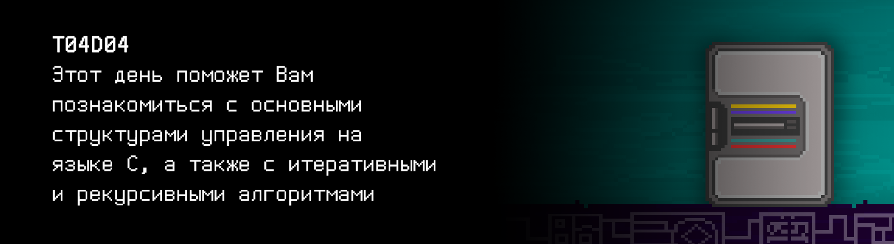
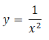

# T04D04

Foydali video materiallarni Platformadagi “Projects (Media)” bo‘limida topishingiz mumkin. 

## Contents

0. [Preamble](#preamble) 
1. [Chapter I](#chapter-i) \
    1.1. [Level 1. Room 4.](#level-1-room-4)
2. [Chapter II](#chapter-ii) \
    2.1 [List 1.](#list-1) \
    2.2 [List 2.](#list-2) \
    2.3 [List 3.](#list-3) 
3. [Chapter III](#chapter-iii) \
    3.1. [Quest 1. Basic control structures. Tom Kilburn.](#quest-1-basic-control-structures-tom-kilburn)  
    3.2. [Quest 2. Basic control structures. Some problems with symbols.](#quest-2-basic-control-structures-some-problems-with-symbols)  
    3.3. [Quest 3. Recursive.](#quest-3-recursive)  
    3.4. [Quest 4. Table.](#quest-4-table)  
    3.5. [Quest 5*. Func.](#bonus-quest-5-func)
4. [Chapter IV](#chapter-iv)

## Preamble

***PRELOAD...***

Siz xonaga kirasiz va xona sizga go’yoki yuklanmagandek ko’rinadi: predmetlar va devorlar xuddi bordek, lekin ular nol va birlardan tuzilgan olib qo’yiluvchi panjaraga o'xshaydi. Bir lahzada shizofreniya qo'rquvi paydo bo'ladi ...

\> *Bu C tilini o'rganishni boshlagan har bir kishi bilan sodir bo'ladimi?*

***PRELOAD...***

To'satdan sizning oldingizda turgan devorda bir va nollar yo'qola boshlaydi va yog'och ramkada qandaydir ma'lumotli varaq aniq hosil bo’ladi. Orqangiz sovuq terga botib, hatto peshonangizda tomchilar paydo bo'ladi. Aftidan, SI haddan tashqari ishlagan va endi sovutish yetarli emas. Ammo o‘qiydigan narsalaringiz qolgan vaqtlarda ham sizni ter to’kishga majbur qiladi...

> Bugundan boshlab, barcha dasturlar, to'g'ri chiqish uchun sinovlardan tashqari, uslublar normalari uchun ham sinovdan o'tkaziladi. Yechimlarni yuborishdan oldin dasturlarni mahalliy sinab ko'rish mumkin. Buni qanday amalga oshirish haqida `materials/instructions_for_testing_rus.md` da ma'lumot mavjud.

Nima bo'lganini tushunganingizdan so'ng, birlar va nollar devorga qaytib, asta-sekin ma'lumot varag'ini o’ziga singdiradi ... siz uchun ko'proq ish degan ma’noni anglatuvchi ma'lumotni. Lekin yuqori sifatli kod – bu ajoyib! Uni o'qish va saqlash osonroq, shuning uchun agar sizdan keyin kimdir bu xonalarga kirsa, u sizning dasturlaringizni SI ularni yana yoqtiradigan qilib osongina o'zgartirishi mumkin. Uning talablari esa shubhasiz ortib boradi, axir u rivojlanmoqda-ku... va bu sizga ham kerak!

## Chapter I

## Level 1. Room 4.

***LOADING Level 1…*** \
***LOADING Room 4…***

            10% yuklanmoqda
            20% yuklanmoqda
            30% yuklanmoqda
            40% yuklanmoqda
        
        1-urinish... Muvaffaqiyatsiz...
        2-urinish... Muvaffaqiyatsiz...
        3-urinish... Muvaffaqiyatsiz...

\> *Nimalar bo'lyapti?*

Xona muvaffaqiyatsiz yuklanganga o'xshaydi, uni tiklashda yordam kerak.

\> *Terminal chiqishini o‘qish*

Siz terminalga qaraysiz. Bu ishga tushishga muvaffaq bo'lgan yagona narsaga o'xshaydi. Atrofda haqiqiy "Hech narsa".

\> *Читать вывод терминала*

Ko'pgina tushunarsiz o'n olti razryadli raqamlar, keyin:

    Agar bu matn organik hayot shakli tomonidan o'qilsa, qabul.
    Yordam kerak, qabul.
    Oldingi xonalardan ba'zi ma'lumotlarni saqlashga muvaffaq bo'ldim.
    Xonani keyingi tiklash faqat mening algoritmlarimni sozlashga bog'liq, qilishing kerak bo’lganlar...

    ...

    *Xatolik...*

    ...

\> *Buni qanday tushunish mumkin?*

Siz kompleksni boshqaradigan SI yordamisiz qolganga o'xshaysiz. \
Xo'sh, nima qilish mumkin? Xonani qanday tiklashni o'z kuchingiz bilan hal qilishingiz va yo'lingizni davom ettirishingiz kerak bo'ladi.

\> *Atrofga qarash*

Qarasangiz, “Atrofda butunlay hech narsa yo'q” deb aytish xato ekanligini sezasiz. Qisman yuklangan xonada axborot tartibsizligi mavjud, xona bo'ylab xaotik ma'lumotlar uchib yuribdi. Bu surreal ko'rinadi.

\> *Пройти вперед*

Siz deyarli teginish orqali oldinga yurasiz. Unchalik ham yoqimli yurish emas. Eng uzoq burchakda, ma'lumotlar tartibsizligida qandaydir mazmunli narsa ko’rinadi. Siz xonaga chuqurroq kirib, stolga o'xshash narsani topasiz. Stolda varaqlar bor. Ulardan birida qandaydir algoritm tasvirlagandek ko'rinadi.

\> *Varaqni o'qish*

***LOADING...***

## Chapter II

## List 1.

Chop etilgan matn:

>Buzilishdan oldin men sen uchun bir nechta vazifalarni tuzishga muvaffaq bo'ldim, demak, hamma narsa ham yo'qolmagan. Sen xonani qayta tiklashing va labirintdan o'tishni davom ettirishing mumkin ...

\> *Keyingi varaqni olish*

***LOADING...***

## List 2.

Keyingi varaqni olasiz...

> - 1-qoida: “goto” muqarrar o’tish operatoridan foydalanishdan saqlaning.
> - 2-qoida. Har qanday dastur uchta asosiy boshqaruv tuzilmasidan quriladi: ketma-ketlik, tarmoqlanish, sikl.
> - 3-qoida. Dasturda asosiy boshqaruv tuzilmalari ixtiyoriy shaklda bir-birining ichiga joylashtirilishi mumkin.
> - 4-qoida. Takrorlanuvchi va har qanday mantiqiy ajratilgan dastur fragmentlari quyi dasturlar (protseduralar va funksiyalar) shaklida tuzilishi mumkin.
> - 5-qoida. Har bir mantiqiy tugallangan ko'rsatmalar guruhi blok sifatida formatlanishi kerak. Bloklar tuzilgan dasturlashning asosidir.
> - 6-qoida. Barcha sanab o'tilgan tuzilmalar bitta kirish va bitta chiqishga ega bo'lishi kerak.
> - 7-qoida. Dasturni ishlab chiqish bosqichma-bosqich, yuqoridan pastga (top- down method) usuli yordamida amalga oshiriladi. \

Varaqning orqa tomonida siz qo'lda yozilgan matnni ko'rasiz.

> Global o'zgaruvchilardan foydalanish taqiqlanadi, chunki ular yashirin aloqalar sonining ko'payishiga olib keladi, bu esa o'z navbatida masshtablilik va o'qish uchun yomon ta’sir qiladi, shuningdek, qiyin payqaladigan xatolarga olib keladi.

\> *Bu varaq bog’lamda tasodifan kelib qolganga o'xshaydi... Yoki undan emasmi? Umuman olganda, bu juda foydali ko'rinadi. Keyingi varaqni olish*

Keyingi varaqni olasiz...

***LOADING...***

## List 3.

Varaq qandaydir g'alati jadvalning bir qismi bo'lib chiqadi. Ehtimol, biror turdagi shifrlash yoki kodlash uchun ishlatilgandir.

>ASCII jadvali. Davomi.

|  | 8 | 9 | A | B | C | D | E | F |
| ------ | ------ | ------ | ------ | ------ | ------ | ------ | ------ | ------ |
| 4 | H | I | J | K | L | M | N | O |
| 5 | X | Y | Z | [ | \ | ] | ^ | _ |
| 6 | h | i | j | k | l | m | n | o |

>...

\> *Keyingi varaqni olish..*

***LOADING...***

## Chapter III

>**Diqqat!** Bu kungi kvestlarda massivlar yaratish va dinamik xotiradan foydalanish taqiqlanadi. Ruxsat etilgan kutubxonalar: `<stdio.h>`, `<math.h>`

## Quest 1.  Basic control structures. Tom Kilburn.

\> *Varaqni o'qish

>Boshidan boshlaymiz.
EHM xotirasida to’liq saqlanadigan birinchi dastur 1948 yil bahorida Tom Kilburn tomonidan “Kichik o’lchovli Eksperimental Mashina” (Small Scale Experimental Machine, SSEM) yoki ular uni mehr bilan atashgan Baby uchun ishlab chiqilgan. \
Ayrim hamkasblarining fikricha, bu ular tomonidan yozilgan birinchi va oxirgi dasturi edi. Babydan yechish so‘ralgan masala berilgan a sonining eng katta tub bo‘luvchisini topish edi. Buning uchun barcha raqamlar saralanishi amalga oshirildi. Bo'linishning o'zi ayirish yo'li bilan amalga oshirildi, chunki bo'linish operatsiyasi uchun apparat yordami yo'q edi. Aytgancha, u hali ham ba'zi arzon mikrokontroller modellarida mavjud emas.
>
>Birinchi vazifa: Tom Kilburnning yo'lidan borish. Siz asosiy boshqaruv tuzilmalaridan foydalanishingiz mumkin – kuzatish, tarmoqlanish va takrorlash, shuningdek, qo'shish, ayirish va ko'paytirish. Bo'linishdan foydalanish mumkin emas – bu modul mikrokontrollerlarda ishlash uchun mo'ljallangan. Kompilyatsiya va ishga tushirilgandan so'ng stdin da raqam qabul qiladigan va uning uchun eng katta tub bo'luvchini hisoblaydigan src/1948.c faylini yarating. Keling, nima qila olishingizni ko'rib chiqamiz.
>
>Eslatib o'tamiz, sonning eng katta tub bo'luvchisi – bir vaqtning o’zida uning eng katta tub ko’paytiruvchisi hamdir.

\> *Terminalga qaytish*

Siz sevimli terminalingizga qaytdingiz. Boshqa to’siqlar yo'qligi sababli, bu muammoni hal qilsa bo’ladi. Eslatib o'tamanki, barcha yechimlar omborga yuklanishi kerak, kiritilgan ma'lumotlar esa to'g'rilik uchun tekshiriladi.

***== Quest 1 qabul qilindi. Berilgan butun `a` sonining eng katta tub boʻluvchisini topib, uni ekranga chop etadigan src/1948.c dasturini tuzing. Ushbu qiymatni hisoblash uchun alohida funksiya ajratish kerak. Bo'lish va bo'lishdan qolgan qoldiq qismini olish operatsiyasidan foydalanish mumkin emas. Biroq, zarur hollarda, bo'lish ayirish yordamida amalga oshirilishi mumkin. Agar xato bo'lsa, "n/a" chiqarilsin. =***

| Kiruvchi ma’lumotlar | Chiquvchi ma’lumotlar |
| ------ | ------ |
| 100 | 5 |
| -4 | 2 |

***LOADING...***

## Quest 2. Basic control structures. Some problems with symbols.

\> *src/1948.c faylini surish*

Aftidan, SI buni kutayotgan edi. Ekranda yana matn paydo bo'ldi.

    Sening qaroringni qabul qildim. Ko'raylikchi.
    Agar muammo haqiqatan ham hal qilingan bo'lsa, unda bu bizga xonani tiklashda yordam beradi.
    Faqat eng katta bo'luvchilar bilan chatoqlik bor edi. Ular bilan doimo muammolar bo’ladi.

    ***Xonani tiklashga urinish*** 

            10%
            20%
            30%
            40%
            50%
            60%
            
            Xatolik…
            Xatolik…

    Hmm, demak gap faqat eng katta bo'luvchilarda emas ekan.
    Lekin hech bo'lmaganda endi ular bilan aniq muammo bo’lmaydi.
    O’zi xonani umuman tiklash shartmi? Shunday ham yaxshi ko'rinyapti.
    Eng katta bo'luvchilarni qidirishda davom etamiz ...

\> *“Xonani tiklash” deb kiritish*

Ekrandagi natija:

    Mayli, davom etamiz.

    ***Tiklashning zaxira moduli yuklanmoqda...
    Modul yuklandi.
    Tiklash moduli ishga tushirilmoqda...***

    48 45 4C 4C 4F 77 4F 52 4C 44 00

\> *Bu nima? Qandaydir kodga o'xshaydi*

Ishga tushirilayotgan zaxira modulida chiqishni kodlash bilan bog'liq muammolar mavjudga o’xshaydi. Va, ehtimol, u sizni tushunmasligi uchun kirishni kodlash bilan bog'liq muammolar ham. Raqamlar sizga varaqlardan biridagi jadvalni eslatadi. Balki, unga e'tibor qaratish lozimdir. \
Ko'rinib turibdiki, bu yerda ikkita rejimda ishlaydigan kichik yordamchi dasturni ishlab chiqish kerak – kodlash va dekodlash. Dasturning ishlash rejimini tanlash buyruq qatori parametri sifatida amalga oshirilishi kerak, bunda 0 – kodlash va 1 – dekodlash. Dekodlashda dastur stdin dan o'n olti razryadli bo'sh joy (probel) bilan ajratilgan butun sonlar qatorini qabul qilishi va bo'sh joy (probel) bilan ajratilgan dekodlangan belgilarni stdout-ga chiqarishi kerak. Kodlashda teskari operatsiya bajarilishi kerak. Kodlash (belgi->raqam) va dekodlash (raqam->belgi) quyi vazifalarining o'zi alohida funksiyalarga ajratilishi kerak. Dastur joylashgan faylni ombordagi src/char_decode.c yo'li bo'ylab joylashtirishni unutma.

***== Quest 2 qabul qilindi. Buyruqlar qatori parametri sifatida ish rejimini (0—kodlash yoki 1—dekodlash) qabul qiluvchi src/char_decode.c dasturini yaratish. Agar dekodlash rejimi tanlangan bo'lsa, dastur stdin-dan bo'sh joy bilan ajratilgan ikki belgili satrlarni qabul qilishi va stdout-ga bo'sh joy bilan ajratilgan dekodlangan belgilarni chiqarish kerak. Kodlashda teskari operatsiya amalga oshiriladi. Kodlash va dekodlash quyi vazifalari alohida funksiyalarga ajratilishi kerak. ASCII jadvaliga e'tibor beriladi. Xato bo'lsa, "n/a" chiqariladi. Kirish yakuni alomati, so’zni bo’lib, keying satrga ko’chirish belgisi yordamida ko'rsatiladi ==***

| Buyruqlar qatori parametrlari | Kiruvchi ma’lumotlar | Chiquvchi ma’lumotlar |
| ------ | ------ | ------ |
| 0 | W O R L D | 57 4F 52 4C 44 |
| 0 | WORLD | n/a |
| 1 | 48 45 4C 4C 4F | H E L L O |
| 1 | 48454C4C4F | n/a |

***LOADING...***

> UNUTMANG! Barcha dasturlaringiz uslub normasi uchun sinovdan o'tkaziladi. Sinovlarni o'tkazish bo'yicha ko'rsatmalar ham `materials` papkasida joylashgan

## Quest 3. Recursive.

\> *Dastur ishlab chiqildi*

    46 49 42 4F 4E 41 43 43 49 32 31

\> *Zaxira modulining chiqishini dekodlash uchun ishlab chiqilgan dasturni qo'llash*

Siz xabarni rasshifrovka qilasiz. Bu rebusga o'xshaydi. Aftidan, uni hal qilish uchun kichik dastur ishlab chiqish kerak. Ushbu dastur hisob-kitoblar natijasini stdout-ga chiqarishi kerak. Uni src/quest3.c ga joylashtirishni unutmang

***== Quest 3 qabul qilindi. Rekursiv algoritm yordamida n-chi Fibonachchi sonini hisoblaydigan va ekranda chiqaradigan src/quest3.cr dasturini yaratish. n-Fibonachchi raqamini qidirishning o’zi alohida funksiyaga ajratilishi kerak. Raqam standart kiritish oqimi orqali kiritiladi. Xato bo'lsa, "n/a" chiqariladi. ==***

| Kiruvchi ma’lumotlar | Chiquvchi ma’lumotlar |
| ------ | ------ |
| 21 | 10946 |

***LOADING...***

## Quest 4. Table.

\>*src/quest3.c dasturini ishga tushirish*

    4F 4B

    ***Xonani tiklashga urinish***

            10%
            20%
            30%
            40%
            50%
            60%
            70%
            80%
            90%
            99%
            
            Xatolik…

\> *Atrofga qarash*

Atrofingizdagi xona nihoyat normal ko’rinishga qaytdi. Devorlari yoqimli pastel ranglar, qulay yorug'lik, fonda yengil, bo’shashtiruvchi embient-musiqa. Ammo eshik bo'lishi kerak bo'lgan joyda, ba'zan to’kilib tushuvchi piksellar panjarasi va “bash” buyruqlar satrlari bilan siyraklashtiriluvchi qora, tubsiz bo'shliq mavjud.
Eshik hali tiklanmagani mutlaqo aniq.

\> *SI modulini ishga tushirish*

    ***Boshlash.. 
    Ishga tushirish.***

    Xona qayta tiklandi. Nega meni ishga tushirding? Men dam olayotgan edim.

\> *Xona tiklanmadi. Eng muhimi – eshik yetishmayapti*

    Kimga qanaqa. Kim tashqarini izlasa, unga eshik muhim. Ichkariga yo'naltirilganlar esa interyerga ko'proq qiziqishadi

... deya falsafona ta'kidladi SI. \
Ogoh bo’lish kerak. Sun'iy intellekt bilan ehtiyot bo'l. Uning xayolida nima borligini hech qachon bila olmaysan.

\> *"Eshikni tiklash uchun nima qilish kerak?" deb kiritish*

Kutilmaganda batafsil javob:

    Afsuski, eshik tenglamasini tavsiflovchi fayl shikastlangan.
    Eshikka shunchalik qiziqayotgan bo’lsang, uni qayta tiklashing kerak bo'ladi.
    Menda analitik formulalar va iboralarni idrok etishda ba'zi muammolar bor, shuning uchun faylda kerakli funksiyaning diskret qiymatlari jadvali bo'lishi kerak.
    Bizni birinchi navbatda manfiy Pi sonidan musbat Pi sonigacha bo'lgan oraliq (ularning o’zini ham qo’shgan holda) qiziqtiradi.
    Pi sonining yuqori darajadagi aniqligi talab qilinmaydi, 20-belgiga qadar aniqlik yetarli.
    Kodda takrorlanmaslik uchun raqamning o'zi alohida o'zgaruvchiga yoki direktivaga yozilishi kerak.
    Hammasi bo'lib, bizga ushbu intervalda aniq 42 o'lchov kerak bo’ladi.
    Fayldagi birinchi ustun – absissa o'qining qiymati, ikkinchi, uchinchi va to'rtinchisi esa – nuqtadagi funksiyalarning qiymatlari.
    Hech qanday jadval sarlavhalari kerak emas.
    Barcha qiymatlar verguldan keyin 7 belgigacha aniqlikda yoziladi. Ustunlar orasidagi ajratuvchi "|" dir. Iltimos, aniqlash sohasiga ehtiyot bo'ling.
    Eshikni tasvirlash uchun qaysi funksiya mos kelishi haqida ishonchli ma'lumotlar yo'qligi sababli uchta funksiya kerak.
    Saqlanib qolgan jurnal yozuvlariga ko'ra, bu birlik diametrli Verzyera Anyezi, musbat yarim tekislikdagi birlik intervalli Lemniskata Bernulli va kvadratik giperbola bo'lishi mumkin.
    Algoritmni src/door_functions.c fayli shaklida tayyorlang, algoritmingiz natijasini esa src/data/door_data.txt fayliga joylashtiring.
    Faylga chiqarish uchun “bash” terminalida kirishni qayta yo'naltirishdan foydalanishingiz mumkin.
    Formulalarni quyida topishingiz mumkin.

Birlik diametrli Verzyera Anyezi: \
 

Musbat yarim tekislikdagi birlik intervalli Lemniskata Bernulli: \
 

Kvadratik giperbola: \
 

***== Quest 4 qabul qilindi. Uch funksiyadan iborat jadvalni hisoblaydigan va ekranga chiqaradigan src/door_functions.c dasturini yarating: birlik diametrli Verzyera Anyezi, musbat yarim tekislikdagi (Y >0) birlik intervalli Lemniskata Bernulli va kvadratik giperbola. Birinchi ustunda manfiy Pi dan musbat Pigacha bo'lgan absissa qiymatlari sanab o’tiladi, ushbu oraliqda 42 o'lchov bo'lishi kerak; Ikkinchi, uchinchi va to'rtinchi ustunlar nuqtadagi funksiyalarning qiymatlarini tavsiflaydi. Jadval sarlavhalari kerak emas. Barcha qiymatlar verguldan keyin 7 belgigacha aniqlikda qayd etiladi, yuqori darajadagi aniqlik uchun “double” tipi ishlatilishi kerak; Ustunlar orasidagi ajratuvchi "/" dir. Jadvalda aniq 42 ta yozuv bo'lishi kerak. Dastur natijasi src/data/door_data.txt fayliga joylashtirilishi kerak (dasturdan faylga yozishni amalga oshirishning hojati yo'q, chiqishni qayta yo'naltirishdan foydalanish mumkin). Agar biror nuqtada funksiya aniqlanmagan bo'lsa, jadvalda "-" belgisi bo'lishi kerak.==***

Результат:

-3.1415927 | 0.0919997 | - | 0.1013212 
-2.9883442 | 0.1007029 | - | 0.1119796 
...............e.r.r.o.r.......................................................

-1.3026116 | 0.3708103 | 0.3061966 | 0.5893457 
-1.1493632 | 0.4308421 | 0.4310262 | 0.7569818

....................................k.i.l.l..m.e..............................

 SI xatosi! 

***LOADING...***

## Bonus Quest 5*. Func.

\> *"Fayllar tayyor" deb kiriting*

Terminalda javob:

    Ajoyib. Eshikni tiklash algoritmini ishga tushirish mumkin.
    Biroq, agar dasturingiz o'zgartirilsa va unda funksiya grafiklarini chop etish qo’shilsa, uni tezlashtirish imkoni mavjud.
    Ortiqcha elementlarsiz, faqat bir xil aniqlash sohasida ketma-ket, biri boshqasining ostidagi grafiklarni.
    Faqat o'zingiz bilgan narsadan foydalanish kifoya qiladi.
    Absissa o'qi bo'yicha masshtab – 42 bo’lma, ordinata o'qi masshtabi – 21.
    “*” belgisi yordamida chizish.
    Biroq, bu zarur emas – tezlashuv kichik bo'ladi.

***== Quest 5 qabul qilindi. src/doorjunctions.c dasturini u terminalda “ \* ” belgilaridan foydalangan holda hisoblanuvchi funksiyalarning grafiklarini chizadigan qilib to’ldiring. Absissa o'qi bo'yicha masshtab – 42 , ordinata o'qi masshtabi – 21. Koordinata o'qlarining joylashishi va aylanishi muhim emas. Yozilgan kodni door_functions_print.c fayliga saqlang ==***

***LOADING...***

## Chapter IV

    ***Fayllar yuklanmoqda...
    Eshik tenglamasini izlash...
    Egri chiziqlarni tekislash...
    Eshiklar generatsiyasi...
    Eshiklar integratsiyasi...***

\> *Atrofga qarash*

Xonaning eng chekka qismida eshik paydo bo'ldi.

\> *Chiqishga harakat qilish*

Eshik qulflanmagan ekan. Ko'rinishidan, SI bunga qodir emas edi.

Tabriklaymiz, siz yana xonadan chiqa oldingiz!

***LOADING...***
