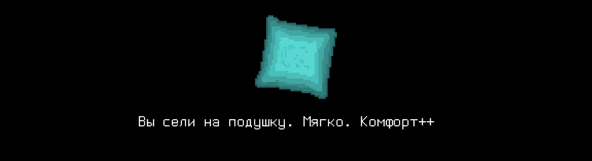

# T05D08

Foydali video materiallarni Platformadagi “Projects (Media)” bo‘limida topishingiz mumkin. 

## Contents

1. [Chapter I](#chapter-i) \
 1.1. [Level 2. Room 1.](#level-2-room-1) 
2. [Chapter II](#chapter-ii) \
 2.1. [List 1. Pointer.](#list-1-pointer) \
 2.2. [List 2. Listing.](#list-2-listing) \
 2.3. [List 3. Operations.](#list-3-operations) \
 2.4. [List 4. Array.](#list-4-array) \
 2.5. [List 5. Equality.](#list-5-equality) 
3. [Chapter III](#chapter-iii) \
 3.1.  [Quest 1. Arguments and pointers.](#quest-1-arguments-and-pointers) \
 3.2.  [Quest 2. Data I/O.](#quest-2-data-io) \
 3.3.  [Quest 3. Data metrics.](#quest-3-data-metrics) \
 3.4.  [Quest 4. Search.](#quest-4-search) 
4. [Chapter IV](#chapter-iv)

# Chapter I

## Level 2. Room 1.

***LOADING Level 2… \
LOADING Room 1…***

Birinchi daraja oson bo’lmadi, lekin siz baribir uni uddaladingiz. Ushbu labirintning yangi darajasi eskisidan farq qiladimi yoki yo'qmi, aytish qiyin. Shunchaki devorlarning rangi biroz farq qiladi ... yoki shunday tuyulyaptimi? Ushbu darajadagi SI xotirjamroq bo'lsa yaxshi bo'lar edi. \
Mana sizning boshingizda to'plangan fikrlarning kichik bir qismi.

\> *Atrofga qarash*

Biroq, xona tipik ko’rinmayapti. Go'yo geometrik hisoblangandek roppa-rossa o'rtada, polda sarg'aygan qog'ozlar to'plamiga ega eski matritsali printer bilan birga kompyuter turibdi. Uning yonida g'ijimlangan yostiq, pechenye uchun likopcha (ushoqlar ko'pligi bundan dalolat beradi) va uzoq vaqt oldin ichilgan choyli chashka (qurigan choy paketi bundan aniq dalolat beradi). Pol va devorlar raqamlar to'plamiga ega bo’lgan varaqlar bilan bir tekis qatlamda qoplangan. Ularning ustiga esa qizil iplar cho'zilgan. Josuslik filmi, boshqacha bo’lishi mumkin emas.

\> *Yostiqqa o'tirish*

Siz yostiqqa o'tirdingiz. Yumshoq. \
Komfort++

\> *Likopcha va chashkani surib qo’yish*

Siz likopcha va chashkani surib qo’ydingiz. Bu unchalik ham yordam bermadi. \
Komfort--

\> *Monitorga qarash*

Terminalda faqat bitta satr bor - Segmentation fault. Kursor miltillamoqda.

\> *Polga qarash*

Xuddi shu turdagi ko'plab varaqlar orasida siz qizil ip bilan o'ralgan "samizdat" bukletini ko'rasiz. Ha, bu metafora kabi eshitiladi.

\> *Bukletni olish*

Buklet tez-tez qo’lga olingan – bu sezilib turibdi. U bilan ehtiyotkorroq bo'lish kerak. Muqovada siz faqat bitta ko'z ilg’amaydigan so'zni ko'rasiz, chop etish mashinasida aniq bosilgan – POINTER. \
Undagi norasmiy qandaydir narsadan biroz junjikib ketasiz.

\> *Sahifani varaqlash*

***LOADING...***

# Chapter II

## List 1. Pointer.

>In 1955, Soviet computer scientist Kateryna Yushchenko invented the Address programming language that made possible indirect addressing and addresses of the highest rank – analogous to pointers. This language was widely used on the Soviet Union computers. However, it was unknown outside the Soviet Union and usually Harold Lawson is credited with the invention, in 1964, of the pointer. In 2000, Lawson was presented the Computer Pioneer Award by the IEEE "for inventing the pointer variable and introducing this concept into PL/I, thus providing for the first time, the capability to flexibly treat linked lists in a general-purpose high-level language". His seminal paper on the concepts appeared in the June 1967 issue of CACM entitled: PL/I List Processing. According to the Oxford English Dictionary, the word pointer first appeared in print as a stack pointer in a technical memorandum by the System Development Corporation.

\> *Sahifani varaqlash*

***LOADING...***

## List 2. Listing.

    void main() {
        int a = 2;      // a == 2
        int b = 4;      // b == 4
        int *p = 0;     // p == 0
        p = &a;         // p == a o’zgaruvchi manzili
        *p = 3;         // a == 3... yoki unday emasmi?
        p++;            // p == b o’zgaruvchi manzili ??!?!?
        (*p)++;         // b == 5 O_o WTF
        *p = *(p - 1);  // b == a == 3 ...
    }

Kimdir POINTERning nima ekanligini tushunishga uringanga o'xshaydi...

\> *Sahifani varaqlash*

***LOADING...***

## List 3. Operations.

> Tipiklashtirilgan ko'rsatgichdagi mavjud operatsiyalar: 
> (balki, hech bo'lmaganda buni shu tarzda eslab qolaman)
>- Manzil qabul qilish
>- Ko'rsatkich tomonidan ko'rsatiluvchi xotira manzilida saqlangan qiymat
>- Raqam bilan qo'shish
>- Ko'rsatkichlarni ayirish
>- Ko'rsatkichlarni taqqoslash
>- Ko'rsatkichlar ustidagi mantiqiy operatsiyalar
>- Ko'rsatkichlarni o’zlashtirish

\> *Sahifani varaqlash*

***LOADING...***

## List 4. Array.

> YODDA TUTING!
>- C tilida massivlar mavjud emas!
>- int a[10] – bu massiv emas!
>- Bu ko'rsatkich! Barchasi ko'rsatkich!
>- Funksiya ham ko'rsatkich.
>- O’zing ham ko’rsatkichsan.
>- Ha, zaldagi o'sha "odamlar" ham ko'rsatkichdirlar.
>- Tajribalar va o‘rganish uchun qulflanganlar...

Jinni odamning eslatmalariga juda o'xshaydi. Shubhasiz, ular shunday.

\> *Sahifani varaqlash*

***LOADING...***

## List 5. Equality.

    void main() {
        int a[10];
        a[2] == *(a + 2) == *(2 + a) == 2[a]; //!!!!!!!!!!!!!!!
    }

\> *Mmm. Juda informativ. Sahifani varaqlash*

Qolgan sahifalar qattiq g'ijimlangan va hammasi chizib tashlangan. Hech narsani aniqlashtirib bo'lmaydi. Shubhasiz, sizning vazifadoshingiz uzoq vaqt davomida bu muammolarni tushunishga harakat qilgan ... Va u unchalik ham buning uddasidan chiqa olmagan. \
Ko’raylik-chi, sen buni qila olarkansanmi?

\> *Bu gijgijlashga o’xshaydi*

Aslo. Faqat hikoyachi va o'yinchi o'rtasidagi do'stona suhbat. Hech qanday g'ayrioddiy narsa emas.

\> *Ixtiyoriy ravishda Enter tugmasini bosish*

    AI Data Analyzer v0.01
    Initialising......
    Loading....
    1. Load module #1... Success!     
    2. Load module #2... Success!
    3. Load desision decision-making module 
    3.1. Load maxmin module

    Segmenation fault

***LOADING...***

# Chapter III
>**Diqqat!** Ushbu kundagi kvestlarda dinamik xotiradan foydalanish taqiqlanadi.
## Quest 1. Arguments and pointers.
\> *Ombordagi src papkasini ko'rish*

Siz bir nechta fayllarni, jumladan, maxmin modulini ko'rasiz.

\> *Maxmin modulini alohida ishga tushirish*

    Segmenation fault

Ko'rinib turibdiki, uni tuzatish kerak.

...

\> *Bir umr maxmin modullarini tuzatishni orzu qilganman.* 

\> *Eslatmani ochish*

> UNUTMANG! Sizning barcha dasturlaringiz uslub normasi va xotira oqimlari uchun sinovdan o'tkaziladi. 
> Sinovlarni o'tkazish bo'yicha ko'rsatmalar ham `materials` papkasida joylashgan

***== Quest 1 qabul qilindi. Dastur yig’ilishi va to'g'ri ishlashi uchun src/maxmin.c dasturiga (3 ta butun sonlardan max va min topadigan va ularni ekranda ko'rsatadigan qilib) tuzatishlar kiritish. Dasturning tuzilishini o'zgartirmang. Noto'g'ri kiritilgan taqdirda n/a chiqarilishi kerak ==***

| Kiruvchi ma'lumotlar | Chiquvchi ma'lumotlar |
| ------ | ------ |
| 1 2 3 | 3 1 |

***LOADING…***

## Quest 2. Data I/O.

\> *Tayyor*

    AI Data Analyzer v0.01
    Initialising......
    Loading....
    1. Load module #1... Success!     
    2. Load module #2... Success!
    3. Load desision decision-making module 
    3.1. Load maxmin module... Success!
    3.2. Load data i/o & squaring module
    
    Segmenation fault

\> *Bu kecha endi tinch o’tmaydi*

Hozir kunduzi. Balki...

\> *Ombordagi src papkasini ko'rish*

Papkada squaring moduli ham mavjud.

\> *squaring modulni alohida ishga tushirish*

    Segmenation fault

Ana shu yerda tuzatish talab qilinadi.

...

***== Quest 2 qabul qilindi. Dastur yig’ilishi va to'g'ri ishlashi uchun src/squaring.c dasturiga tuzatishlar kiritish (stdin orqali butun sonlar massivini olishi, ularni kvadratga ko’tarishi va stdoutga chiqarishi kerak). Noto'g'ri kiritilgan taqdirda, n/a chiqarilishi kerak. Dekompozitsiyani kamaytirish mumkin emas – funksiyalarni faqat zarur bo'lganda qo'shish mumkin, lekin olib tashlanmaydi. ==***

| Kiruvchi ma'lumotlar | Chiquvchi ma'lumotlar |
| ------ | ------ |
| 3 1 2 3 | 1 4 9 |

***LOADING…***

## Quest 3. Data metrics

\> *Tayyor*

    AI Data Analyzer v0.01
    Initialising......
    Loading....
    1. Load module #1... Success!     
    2. Load module #2... Success!
    3. Load desision decision-making module 
    3.1. Load maxmin module... Success!
    3.2. Load data i/o & squaring module... Success!
    3.2. Load stat module
    
    ERROR 

"Yana qancha davom etadi bu" degan fikr o’tadi boshingizdan.

\> *Omborning src papkasiga yana qarash*

Papkada stat moduli mavjud. U deyarli bo'sh. Ko'rinishidan, u ma'lumotlar massivi bo’yicha statistik ko'rsatkichlarni hisoblash uchun mo'ljallangan.

\> *Matematik statistika bo'yicha darslikni ochish*

Sizning muhtaram jinni do'stingiz uni bu yerda qoldirmagan. Taxmin qilib, aniqlashtirishga to’g’ri keladi.

...

***== Quest 3 qabul qilindi. Dastur yig'ilishi va to'g'ri ishlashi uchun src/stat.c dasturiga kerakli funksiyalarni amalga oshirishni qo'shish (stdin orqali butun sonlar massivini olib, uni chiqarib, hisoblashi va yangi satrda statistik ko'rsatkichlar to'plamini ko’rsatishi kerak – biz diskret bir maromdagi taqsimot bilan shug'ullanayotganimizni hisobga olib, ekstremumlar (max va min), matematik kutish va dispersiya). Noto'g'ri kiritilgan taqdirda, n/a ni chiqarilishi kerak. Dekompozitsiyani kamaytirish mumkin emas - funksiyalarni faqat kerak bo'lganda qo'shish mumkin, lekin olib tashlash mumkin emas. Taklif etilgan dastur tuzilishiga rioya qiling. Verguldan keyin 6 belgi aniqligida suzuvchi nuqtali raqamlarni chiqaring. ==***

| Kiruvchi ma'lumotlar | Chiquvchi ma'lumotlar |
| ------ | ------ |
| 4 1 2 3 4 | 1 2 3 4 4 1 2.500000 1.250000 |

***LOADING…***

## Quest 4. Search.

\> *Tayyor*

    AI Data Analyzer v0.01
    Initialising......
    Loading....
    1. Load module #1... Success!     
    2. Load module #2... Success!
    3. Load desision decision-making module 
    3.1. Load maxmin module... Success!
    3.2. Load data i/o & squaring module... Success!
    3.2. Load stat module... Success!
    3.4. Load searching module
    
    NOT FOUND 

\> *Ombordagi src papkasini yana bir marta ko'rish*

search moduli mavjud. Ammo u sizga yoqmayapti.

\> *search modulini ko‘rish*

Faqat sharhlar. Kod yo'q. Davom etish uchun, aftidan, uni amalga oshirish kerak.

...

***== Quest 4 qabul qilindi. Izohga muvofiq src/search.c dasturini amalga oshirish. Dastur stdin orqali butun sonlar massivini qabul qilishi va unda quyidagi talablarga javob beradigan sonning birinchi kirishini topishi kerak: juft bo‘lish, matematik kutishdan katta yoki teng bo‘lish, uch sigma qoidasiga bo‘ysunishi va 0 teng bo’lmasligi kerak. Topilgan raqam stdout-ga chiqariladi. Agar bunday raqam bo'lmasa, u holda dastur 0 ni chiqarishi kerak. Kiritilgan raqamlarning maksimal soni 30 ta. Noto'g'ri kiritilgan taqdirda n/a chiqarilishi kerak. Ishlab chiqishda, avvalgi kvestlar dekompozitsiyasi g'oyalariga rioya qilish kerak, allaqachon ishlab chiqilgan funksiyalardan qayta foydalanish ma’qullanadi; Funksiyalar ixcham va sodda bo'lishi kerak va 20-30 kod satridan oshmasligi kerak. ==***

| Kiruvchi ma'lumotlar | Chiquvchi ma'lumotlar |
| ------ | ------ |
| 4 1 2 3 4 | 4 |

***LOADING…***

# Chapter IV.

\> *Bu yaxshilik bilan tugamaydi. Tayyor.*

    AI Decision Making Module v0.01
    Initialising......
    Loading....
    1. Load module #1... Success!     
    2. Load module #2... Success!
    3. Load data modules 
    3.1. Load maxmin module... Success!
    3.2. Load data i/o & squaring module... Success!
    3.2. Load stat module... Success!
    3.4. Load searching module... Success!

    .........
    ............
    ...............

    Hello. Standart qaror qabul qilish moduliga xush kelibsiz. Qanday yordam berishim mumkin?

\> *Kiritish: «Men ~~derazadan~~ eshikdan chiqmoqchiman»*

    So'rov tahlili...
    Ma'lumotlarni yig'ish...
    Ma'lumotlarni tahlil qilish ...
    Qaror qabul qilish...

    Eshik ochiq.
    Sizni keyingi xonada kutishmoqda, davom eting.
    v0.01 qaror qabul qilish xizmatlaridan foydalanganingiz uchun tashakkur.

\> *Eshikni ochish *

Bu safar qandaydir tinch va oddiy o’tdi. Qiziq, o’sha jinniga nima bo'ldi? Siz u bilan kelajakda uchrashasizmi? \
Eshik ochiq ekan va siz chop etilgan xotira bloklari bo'lgan varaqlarni shitirlatib, cho'zilgan iplarga biroz qoqinib, xonadan bemalol chiqib ketdingiz.

***LOADING…***

