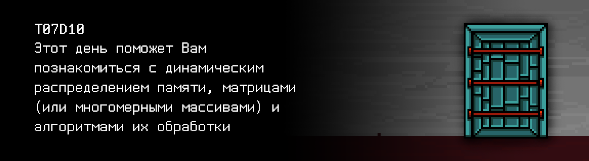

# T07D10 


Foydali video materiallarni Platformadagi “Projects (Media)” bo‘limida topishingiz mumkin. 




## Contents

1. [Chapter I](#chapter-i) \
 1.1. [Level 2. Room 3.](#level-2-room-3)
2. [Chapter II](#chapter-ii) \
 2.1. [List 1.](#list-1) \
 2.2. [List 2.](#list-2) 
3. [Chapter III](#chapter-iii) \
 3.1. [Quest 1. Allocate memory first...](#quest-1-allocate-memory-first) \
 3.2. [Quest 2. Try not to leak then.](#quest-2-try-not-to-leak-then) \
 3.3. [Quest 3. The 1+3 ways.](#quest-3-the-13-ways) \
 3.4. [Quest 4. MinMax search.](#quest-4-minmax-search) \
 3.5. [Quest 5. Making a picture.](#quest-5-making-a-picture) \
 3.6. [Quest 6. Another sort.](#quest-6-another-sort) \
 3.7. [Quest 7. Matrix arithmetic.](#quest-7-matrix-arithmetic) \
 3.8. [Quest 8. The Magic Key.](#quest-8-the-magic-key)
4. [Chapter IV](#chapter-iv) 


# Chapter I

## Level 2. Room 3.

***LOADING Level 2…*** \
***LOADING Room 3…***

Devorlar, eshik, stol, kompyuter, qog’oz varaqlari, devor qoplamasi – barchasi joyida. bu tinchlantiradi.

\> *Eshikdan foydalanib ko’rish*

Har doimgidek berk. Stol tomon burilib siz devorga osilgan noaniq surat tomon ko’zingiz tushadi.

\> *Oldindan yaxshilab ko’rib olish*

                1 1 1 1 1 1 1 1 1 1 1 1 1
                1 0 0 0 0 0 1 0 6 6 6 6 1
                1 0 0 3 3 0 1 0 0 6 6 6 1
                1 0 3 3 3 3 1 0 0 6 6 6 1
                1 0 3 3 3 3 1 0 6 0 0 6 1
                1 0 0 3 3 0 1 0 0 0 0 0 1
                1 0 0 7 7 0 1 0 0 0 0 0 1
                1 1 1 1 1 1 1 1 1 1 1 1 1
                1 0 0 7 7 0 1 0 0 0 0 0 1
                1 0 0 7 7 0 1 0 0 0 0 0 1
                1 0 7 7 7 7 1 0 0 0 0 0 1
                1 0 0 0 0 0 1 0 0 0 0 0 1
                1 0 0 0 0 0 1 0 0 0 0 0 1
                1 0 0 0 0 0 1 0 0 0 0 0 1
                1 1 1 1 1 1 1 1 1 1 1 1 1

Bir qancha vaqt ushbu masala ustida bosh qotirasan, bu nimaga o’xshash bo’lishi mumkin, u kim tomondan v anima maqsadda qoldirilgan. Bu masala bo’yicha javob topish urinishlaringni chetga surib, sen kompyuter va yozilgan qog’oz varaqlari taxlami turgan stolga yaqinlashasan. 


\> *Yuqoridagi varaqni olish*

***LOADING...***


# Chapter II

## List 1.

>...
>Sehrli kvadrat - bu har bir satr, har bir ustun va diagonaldagi raqamlar yig'indisi bir xil raqamga (sehrli yig'indi) teng bo'lishi uchun tuzilgan raqamlarning kvadrat jadvali. Sehrli kvadratni matritsaning birinchi eslatmasi deb hisoblash mumkin.  
>Dunyoga ma'lum bo'lgan eng qadimgi sehrli kvadratlardan biri Lo Shu kvadratidir. U Qadimgi Xitoyda ixtiro qilingan, toshbaqa qobig'idagi birinchi tasvir miloddan avvalgi 2200 yilga to'g'ri keladi.  Shuningdek, sehrli kvadratlar arab matematiklarigabiroz keyinroq ma'lum bo'lgan, aynan taxminan o'sha paytda matritsalarni qo'shish printsipi paydo bo'lgan. "Matritsa" atamasi 1850 yilda Jeyms Silvestr tomonidan kiritilgan.
>
>...

\> *Juda qiziqarli. Keyingi betga o’tish*

***LOADING...***


## List 2.

Qolgan bo'sh va qisman yozilgan varaqlar to'plamini varaqlaganingizdan so'ng, siz "Xotirani boshqarish" qisqa sarlavhali varoqlardan biriga e'tiboringizni to'xtatasiz. Sarlavhadan pastroqda muallif ismlari bosh harflari keltirilgan: B. Kernigan, D. Ritchi.

\> *Varaqni o’qish*

>malloc va calloc funktsiyalari uyumda bo'sh xotira bloklarini dinamik ravishda so'raydi.
```void *malloc(size_t n)``` 
>Agar so’rovni qoniqtirish iloji bo’lmasa ko’rsatkichni ishga tushirilmagan yoki NULL xotirasining n baytiga qaytaradi
```void *calloc(size_t n, size_t size)``` 
>ko'rsatgichni belgilangan o'lchamdagi (size)  n ob'ektdan iborat massivni saqlab turish uchun yetarlicha maydonga qaytaradi yoki so'rovni qondirib bo'lmasa NULL. calloc tomonidan ajratilgan xotira nolga qaytariladi.
>malloc va calloc funktsiyalari tomonidan qaytarilgan ko'rsatgich belgilangan ob'ekt turiga muvofiq amalga oshirilgan tenglashtirish asosida beriladi. Shunga qaramay, dasturning keying fragmentida bajarilgandek unga nisbattan kerakli turga keltirish operatsiyasi qo’llanilishi mumkin:

>```int *ip;```<br/>```p = (int*) calloc(n, sizeof(int));```

Keyingi matn, afsuski, oxirigacha chop etilmaganga o'xshaydi. Yoki oddiygina eskirkanidan xiralashgan. O'tmishdagi texnologiyalar ... ishonchni oqlamaydi.

\> *Davomini boshqa varaqlarda qidirib ko’rish*

Hech narsa topilmadi. Faqatgina kompyuterni yoqish va labirint orqali oldinga siljish uchun SI bilan muloqotni davom ettirish qoladi.

\> *Kompyuterni yoqish*

25 kadrlik ekranda matn paydo bo’ladi:
> Dasturlaringizni uslub me'yorlari va xotira oqib ketishiga tekshirishni unutmang! \
> Dasturlaringizni uslub me'yorlari va xotira oqib ketishiga tekshirishni unutmang! \
> Dasturlaringizni uslub me'yorlari va xotira oqib ketishiga tekshirishni unutmang! \
> `materials` ga tez tez nazar solib turing.....

Bu testlarni SI ning hushi ko’tarmaydi.

***LOADING...***


# Chapter III

## Quest 1. Allocate memory first...

Odat sifatida xonaning repozitoriysini yuklaganda, siz yana nigohingizni xotirani boshqarish maqolasi haqidagi varoqqa qaratasiz. SI yoqilmasdan oldin yangi ma’lumotni ishda qo’llash kerak. Kim biladi birdan kelajakda bu sizga qo’l kelsa.  \
Massiv uchun xotirani dinamik ajratib (malloc va calloc funksiyasi yordamida) o’tgan xonadan massivni saralash dasturini to’ldirish va qayta yozish kerak (src/sort.c). n massiv uzunligi kiritilishdan oldin foydalanuvchi tomonidan ko’rsatiladi. \
O’zgartirilgan dasturni src/sort.c. fayliga joylashtirish lozim. Har ehtimolga qarshi turaversin.

***== Quest 1 qabul qilindi. Oxirgi xonadan src/sort.c dasturini shunday o’zgartirish lozimki massiv uchun xotira dinamik ajralib tursin (malloc va calloc funksiyasi yordamida). `n` massiv uzunligi massivni kiritmasdan oldin stdin da ko’rsatiladi. Har qanday xatólik yuz berganda “n/a” chiqaring. Chiqarishning oxirida satr ko’chirish belgisi bo’lmasligi kerak ==***

| Kirish ma’lumotlari | Chiqish ma’lumotlari |
| ------ | ------ |
| 10<br/>4 3 9 0 1 2 100 2 7 -1 | -1 0 1 2 2 3 4 7 9 100 |

***LOADING...***


## Quest 2. Try not to leak then.

O’zingizning repozitoriyingizda massivni saralash o’zgartirilgan dasturini ishga tushirib, oldindan qandaydir pand yeyishni kutib siz SI modulini ishga tushirishga qaror qilasiz.

\> *SI ni ishga tushirish*

Siz terminaldagi chopar satrlarga nazar solib turibsiz:

    Modullarni ishga tushirish… … … Muvaffaqiyatli
    Interaktiv qobig’ni ishga tushirish… … … Muvaffaqiyatli
    Modullarni tekshirish… … … Muvaffaqiyatli
    Xotirani tekshirish… Xotiraning asosiy moduli – Muvaffaqiyatli
    Xotirani tekshirish… … … Ogohlantirish: Potensial xavfli joy topildi
    xotiraning sizishi: src/sort.c …
    …

    Bu meni sindirishga bo'lgan ayanchli urinishingmi, "inson"? Qarasam oldin o’zing tomoningdan yaratilgan saralash modulini o’zgartiribsan. Biroq, sening urinishlaring muvaffaqiyatsizlikka uchraydi. Agar xotiram tugasa, men qayta ishga tushaman va biz hammasini qaytadan boshlaymiz. Sen xohlagan narsa emas, a?

\> *Kiritish “Men faqat yangi bilimlarim bo’yicha masq qilayotgandim xolos, men hech narsani nazarda tutmagandim”*

    “Inson” men sen qanchalik mukammal emasligingni unutaman. Saralash modulidagi xotira sizishidan qutul, balki yana qandaydir yangiliklarni bilib olasan. 

\> *So’rovni kiritish “Qanday sizib chiqish?”*

    …

Sen yana qandaydir vaqt SI dan javob kutasan, lekin u jim. Balki o’sha to’liq chop etilmagan qog’oz bo’lagini to’liq naqlini qayerdandir topib uni e’tiborliroq o’rganib chiqish kerakdir. Birato’la SI qanday xotira sizib chiqishi haqida gapirganligini aniqlab u haqiqatdan ham mavjud bo’lsa uni bartaraf etish. Asosiysi src/sort_no_leak.c. faylidagi o’zgartirilishni ishga tushurish.

***== Quest 2 qabul qilindi. src/sort\_no\_leak.c dasturini yaratish unda src/sort.c. dasturidagi xotira sizib chiqishidan qutilish. Agar boshidan sizib chiqish mavjud bo’lmasa shunchaki src/sort.c ni src/sort_no_leak.c ga nusxalash ==***

| Kirish ma’lumotlari | Chiqish ma’lumotlari |
| ------ | ------ |
| 10<br/>4 3 9 0 1 2 100 2 7 -1 | -1 0 1 2 2 3 4 7 9 100 |

***LOADING...***


## Quest 3. The 1+3 ways.

SI hali ham jim.

\> *Kiritish “Sizib chiqish mavjud emas”*

    Xotirani tekshirish… … … Muvaffaqiyatli
    Ishlash xususiyatini tahlil qilish moduli: Holat – Ok.

    Yaxshi. Saralash modulining ishga tushirilishi muvaffaqiyatli o’tdi. Sen ushbu joyning kalitini kutayotganga o’xshaysan?
    Avvaliga kuch sarflashinga to’g’ri keladi. Massivlar bilan sen allaqachon tanishsan. Endi massivlarning massiviga o’tamiz.
    Odatda sizlar ularni matritsalar deb ataysizlar. Ularni qayta ishlash uchun menga qo’shimcha modul kerak va sen menga yordam berasan.
    Albatta, agar bu yerdan chiqishni xoxlasang. Oddiysidan boshla. Masalan, src/matrix.c matritsalarni qayta ishlash modulini ularni kiritish- chiqarish bilan rasmiylashtirishdan.
    Biroq men matritsalarni qabul qilishni va ularga turli xil usullar bilan xotira ajratishni xoxlayman. 
    Ulardan biri, umid qilamanki sen oxirgi xonada bilib olgansan: statistik. Boshqalari bilan sen bugun tanishishni boshlagansan. 
    Nima haqida gap borishi mumkinligi haqida fikrlab ko’r. 
    Bu massivlarni va massiv ko’rsatgichlarni tashkil etish haqida albatta. 
    Agar boshinga hech narsa kelmasa sen sevgan repozitoriy bo’yicha yo’l yo’riq qidirsang bo’ladi. Bu yerda u bilan bo’liq qandaydir rasmlar bor edi.
    Va tabiiyki qolgan barcha funksiyalar shunday usulda yaratilishi kerakki ular xotira ajratish usuliga bog’liq bo’lmasligi kerak. copy-paste ni payqasam hamma repozitoriyanga rm-rf ni qo’llayman. Matritsa o’lchami stidin dagi har ikki son orqali qabul qilinishi kerak. 

    Aytgancha, yodimdan ko’tarilay debti (hazil, men yoddan chiqara olmayman) –  matritsa topshiriqining usulini tanlash 1-4 bandlar bilan menyu ko’rinishida bezatilishi kerak. Buni siz insonlarga qulay bo’lgan ko’rinishga keltir. Mening bazi bir modullarim UI ga  juda injiq.

    O’zingdan keyin qayerdadir xotirani tozalash yodingdan chiqsa, nima bo’lishi haqida jim turaman.

    …

Sen “talablar ro’yxati buncha uzun bo’lmasa” – deb o’ylading. Bu SI ning ishtaxasi kuniga emas soatiga o’sadi. Xo’p, har qanday holda bu ajoyib amaliyot bo’ladi. 

***== Quest 3 qabul qilindi. To’liq sonli matritsalar qabul qiladigan va chiqaradigan src/matrix.c dasturini qo’shishing.
Matritsa uchun xotira ajratishni 4 turda amalga oshirish kerak: statistic va 3 ta dinamik. Statik ajratishda matritsaning maksimal o’lchami 100x100 dan oshmaydi. Dasturda xotira ajratish usulini tanlash uchun  1-4 bandli menyu shakllantirish kerak. Matritsa o’lchami (avval satrlar soni, keyin ustunlar) stdin da uni kiritilishidan oldin ikki son orqali qabul qilinadi. Shuningdek, barcha ajratilgan xotirani tozalash kerak.
Yo’l yo’riq uchun materials papkasiga murojat qilish kerak. Matritsani chiqarishda e’tibor qarating: har bir satr oxirida ortiqcha bo‘sh joy bo‘lmasligi kerak. Oxirgi satrdan keyin yangi satrga ko’chiradigan belgi bo’lmasligi kerak.
Har qanday xatolik yuz berganda “n/a“ ni chiqaring ==***


| Kirish ma’lumotlari | Chiqish ma’lumotlari |
| ------ | ------ |
| 2<br/>2 2<br/>4 3<br/>9 0 | 4 3<br/>9 0 |

***LOADING...***


## Quest 4. MinMax search.

Matritsalarning kirich-chiqish kodini yozish va uni sozlash uchun tuzuk vaqt sarf qilib, oxirida sen bu topshiriqni muvaffaqiyatli yakunlading. Bir daqiqadan so’ng sening e’tiboringni dinamiklardan to’satdan tarqalayotgan mexanik, dirillagan ovoz tortadi:

> Yomonmas “inson”. Endi..Bbbilasan mening -minimaks degan sevimli o’yinim bor. Biz kechqurunlari ehtimolli spontan eshik ochilish moduli bilan uni o’ynashni yaxshi ko’ramiz… Uning nazariyasiga seni zo’rlab kiritishga mening xohishim yo’q, sening esa biror narsani tushunishing ehtimoli kam. Shuning uchun oddiyroq topshiriqni olamiz: matritsalarni qayta ishlash modulini shu tarzda to’ldirki, u qo’shimcha tarzda matritsaning har bir satridagi maksimal elementni va uning har bir ustunidagi minimal elementni topib oxirida ekranga chiqarsin. Va dasturni yangi versiyasini src/matrix_extended.c. da saqlab qol. \
> Umid qilamanki allaqachon qilgan narsangni buzib qo’ymaysan. Aks holda juda alamli hodisa bo’ladi… \
> Alamli.

***== Quest 4 qabul qilindi. src/matrix.c. dasturini funksionalini kengaytiradigan src/matrix_extended.c dasturini qo’shish. Matritsaning har bir satridagi maksimal elementni va uning har bir ustunidagi minimal elementlarni topish va bu qiymatlarni oxirida matritsani ikki massiv ko’rinishida chiqarishdan keyin chiqarish (har bir satrdagi maksimal elementlar massivi va har bir ustundagi minimal elementlar massivi). Birinchi son bilan xotira ajratish usulining raqami kiritiladi. Shuningdek e’tibor bering: oxirgi satrdan keyin hech qanday ko’chirish belgilari bo’lmasligi kerak(!) ==***

| Kirish ma’lumotlari | Chiqish ma’lumotlari |
| ------ | ------ |
| 2<br/>3 3<br/>4 3 1<br/>9 0 55<br/>-4 7 111 | 4 3 1<br/>9 0 55<br/>-4 7 111<br/>4 55 111<br/>-4 0 1 |

***LOADING...***


## Quest 5. Making a picture.

Repozitoriyda navbatdagi o’zgarishlarni qayd qilib, sen SI ning senga “to’satdan” yangi murojaatini kuta boshlading. Biroq, sening tajjubinga murojaat bo’lmadi.

\> *Kiritish “Minmaks qiymatlar qidiruvi qo’shildi”*

    Modullarni tekshirish… … … Ogohlantirish: CLI grafik modulining ulanishga urinish – Muvaffaqiyatsiz
    …
    “Inson” mening eng oddiy grafik modulim ishdan chiqdi. Sizlar “deraza ortidagi tabiat” deb nomlovchi manzarani chizishga urunish muvaffaqatsizlikka duch keldi.
    src/picture.c ga kirib muammo nimadaligini bil. 

\> *Kiritish “Men aalqachon sening hoxishlaringni bajardim, endi esa menga kalit kerak”*

    …

\> *Kiritish „Men kalitni olmagunimcha joyimdan qimirlamayman“*

    …

\> *Kiritish „Men kalitni olmagunimcha joyimdan qimirlamasligim haqida yozaman“*

    …

Yana jimjitlik. Bugun SI e’tiborga olmaslik siyasatini tanlaganga o’xshaydi. src/picture.c ichida sen birlardan, yettilardan, oltilardan va uchlardan tashkil topgan bir nechta massivlarni va matritsalarni, shuningdek siklda ularning tushunarsiz qayta ishlaganligini ko’ryapsan. Sen o’zing bilmagan holda devorda osilgan eski rasm tomon o’girilding. Nahotki mazkur modul yordamida SI aynan uni chizishni xohlagan bo’lsa? Mazkur rasm “chiziladigan” yangi matritsani yaratish uchun tayyorlab qo’yilgan massivlarni ishlatib ko’rishning fursati keldi.

***== Quest 5 qabul qilindi. src/picture.c dasturini shunday o’zgartirish kerakki, u xona [devoridagi rasmni](#level-2-room-3) oldin tayyorlangan massivlar kodi va matritsa yordamida terminalda chizsin. Statistik massivlarni va matritsalarni o’zgartirish mumkin emas. ==***

***LOADING...***


## Quest 6. Another sort.

“Rasm haqiqatdan ham qiziqarli chiqdi, lekin bu shunga arziydimi? Va bu meni yechimga qanchalar yaqinlashtirdi?”, - deb o’ylading. To’satdan buyruq satrida belgilar paydo bo’la boshladi:

    Modullarni tekshirish… … … Muvaffaqiyatli
    CLI grafik modulini ishga tushirish:

                1 1 1 1 1 1 1 1 1 1 1 1 1
                1 0 0 0 0 0 1 0 6 6 6 6 1
                1 0 0 3 3 0 1 0 0 6 6 6 1
                1 0 3 3 3 3 1 0 0 6 6 6 1
                1 0 3 3 3 3 1 0 6 0 0 6 1
                1 0 0 3 3 0 1 0 0 0 0 0 1
                1 0 0 7 7 0 1 0 0 0 0 0 1
                1 1 1 1 1 1 1 1 1 1 1 1 1
                1 0 0 7 7 0 1 0 0 0 0 0 1
                1 0 0 7 7 0 1 0 0 0 0 0 1
                1 0 7 7 7 7 1 0 0 0 0 0 1
                1 0 0 0 0 0 1 0 0 0 0 0 1
                1 0 0 0 0 0 1 0 0 0 0 0 1
                1 0 0 0 0 0 1 0 0 0 0 0 1
                1 1 1 1 1 1 1 1 1 1 1 1 1

    „Deraza ortidagi tabiat“, ajoyib, shunday emasmi “inson”?

    Senga yoqdimi? Menga odamlarga derazalar yoqishi haqida ma’lumot bor. Lekin qayg’uli narsalar haqida gapirmaymiz. Men sen kalitni olish istaging borligini ko’rdim. Buning uchun yana kamroq miyangni zo’riqtiramiz. Havotirlanma, bu sizlarninu nehkfhbyu uchun azobli ekanligi haqida juda yaxshi bilaman. Ha-Ha.

    Matritsalar uchun saralash modulini src/matrix_sort.c ga qo’sh. U matritsalar satrini shunday taqdim etishi kerakki, minimal qiymatli elementlar satri yuqorida, maksimal qiymatlilari esa pastda bo’lishi kerak. Kirish uchun men N va M ni beraman – matritsaning bir maromdaligi, keyin esa avvalgidek sonlarning NxMi.

    Matritsa uchun xotira ham dinamik ajratilishi kerak. Menga shunisi qulayroq.

    Yo’q, bu o’yinlar uchun emas.

***== Quest 6 qabul qilindi. src/matrix\_sort.c dasturini qo’shish, u berilgan matritsani shunday saralashi kerak-ki avval satrdagi elementlarni minimal qiymati keyin esa maksimal qiymati kelsin. Kirishga N va M sonlari beriladi – matritsaning bir maromdaligigi va sonlarning NxM- matritsa elementlari. Matritsa uchun xotira 3 usuldan birida dinamik ajratilishi kerak. Va shuningdek dastur ishining oxirida bo’shatilishi kerak. Har qanday xatolik yuzaga kelganda "n/a" ni chiqaring. ==***

| Input | Output |
| ------ | ------ |
| 1<br>3 3<br>4 3 1<br>9 0 55<br>-4 7 -10 | -4 7 -10<br>4 3 1<br>9 0 55 |


***LOADING...***


## Quest 7. Matrix arithmetic.

\> *Kiritish „Saralash moduli qo‘shildi“*

    Modullarni tekshirish… … … Muvaffaqiyatli
    Xotirani tekshirish … … … Muvaffaqiyatli

    Ehtimol, qachondir sen mening aql-zakovatimning o'ndan bir foiziga ham erisha olasan.
    Juda yaxshi “inson”. Lekin bo’shashma. Men 3 - xona 2 - daraja kaliti bo’yicha topgan narsalarim senga yoqmaydi.
    Menimcha og’ri botishi ham mumkin. Ruhiy jihatdan. Kalitga yetish uchun sen mening yana bir modulimni sozlashing kerak: 
    src/matrix_arithmetic.c.
    U matritsalarni qo’shish, ularni ko’paytirish va transponlash kabi operatsiyalarni amalga oshirishi va albatta natijani chiqarib berishi kerak. Operatsiyani amalga oshirish imkoni mavjud bo’lmagan taqdirda “n/a” ni chiqar.
    O’lchamlarini va matritsalarni kiritishda operatsiya kodi kiritilishini qo’sh, u yerda 1 – qiymat, 2- ko’paytirish, 3 – transponlash. Shundan keyin men senga barcha kerakli ma’lumotni beraman. Aytgancha, sen sevgan barcha neyron tarmoqlaringni biz matritsalar ko’paytmasi deb hisoblashimizni bilarmiding?

***== Quest 7 qabul qilindi. Uch operatsiyadan birini amalga oshiradigan src/matrix_sort.c dasturini qo’shish: 1- ikkita matritsaning yig'indisi, 2- ko’paytirish yoki 3- transponlash. O’lchamlar va matritsalarni kiritishdan oldin tegishli operatsiya kodi  kiritiladi. Matritsalar oldindagidek to’liq sonli. Qandaydir xatolik yuz berganda “n/a” kiritish. ==***

| Kirish ma’lumotlari | Chiqish ma’lumotlari |
| ------ | ------ |
| 1<br/>2 2<br/>4 3<br/>9 0<br/>2 2<br/>1 1<br/>2 2 | 5 4<br/>11 2 |
| 2<br/>2 3<br/>4 3 1<br/>9 0 2<br/>3 1<br/>1<br/>2<br/>3 | 13<br/>15 |
| 3<br/>2 2<br/>4 3<br/>9 0 | 4 9<br/>3 0 |


***LOADING...***


## Quest 8. The Magic Key.

\> *Kiritish “Men arifmetika modulini sozladim, va nihoyat menga kalit bo’yicha ma’lumot ber!”*

    Modullarni tekshirish… … … Muvaffaqiyatli

    3-xonaning 2-darajasi bo’yicha ma’lumot qidiruvini boshlash…
    … 
    … 
    …

                1 T       87  46  57  29
                2    *   129 156 122 141
                3        143 127 107 116
                4         69  78 112 101
                
    Masalani yech va men javobni key10.txt. da saqlashni tavsiya etaman. Qachonki sen yo’lingni davom ettirsang seni keyingi xonada kutaman…

Mana nima uchun SI senga matritsali arifmetik moduil kerakligini aytdi. Ko’rinishi oddiy, endi natijani hisoblasak ham bo’ladi.

***== Quest 8 qabul qilindi. Keltirilgan masalani yechish va hisob kitoblar natijasini src/key10.txt da saqlash ==***

***LOADING...***


# Chapter IV

Javobni key10.txt. da yozishdan va barcha o’zgarishlarni repozitoriyda saqlashdan keyin xona eshigi ochildi. Paydo bo’lgan tirqishdan klaviatura tovushi bilan aralash oq yorug’lik hamda kimnidir tovushi tarqala boshladi. Nima bu? Seni yangi xona chaqiryaptimi? Yoki intensiv ishdan keyin senga har xil narsalar tuyulyaptimi? Har qanday holda buni bilishning faqat bir usuli mavjud… 

***LOADING...***

