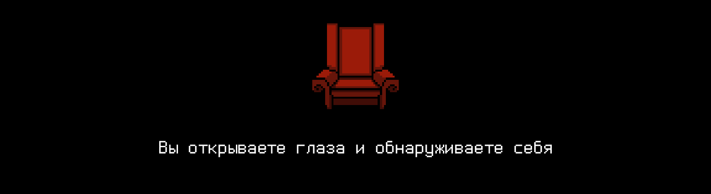

# T09D15

Foydali video materiallarni Platformadagi “Projects (Media)” bo‘limida topishingiz mumkin.

## Contents

1. [Chapter I](#chapter-i) \
 1.1. [Level 3. Room 1.](#level-3-room-1) 
2. [Chapter II](#chapter-ii) \
 2.1. [List 1.](#list-1)
3. [Chapter III](#chapter-iii) \
 3.1. [Quest 1. Modules.](#quest-1-modules) \
 3.2. [Quest 2. Modules II.](#quest-2-modules-ii) \
 3.3. [Quest 3. Makefile.](#quest-3-makefile) \
 3.4. [Quest 4*. Macro.](#bonus-quest-4-macro) \
 3.5. [Quest 5. Static Lib.](#quest-5-static-lib) \
 3.6. [Quest 6. Dynamic Lib.](#quest-6-dynamic-lib) 
4. [Chapter IV](#chapter-iv) 

# Chapter I

## Level 3. Room 1.

***LOADING Level 3… \
LOADING Room 1…***

Bir mahal, qora dengizda ritm urayotgan "Hayot o‘yinlari" tuzilmalariga qarayapsan ekan va, xoynahoy, uxlab qolganingni tushunding. Ko‘zingni ochib qarasang katta stol yonida qulay o‘rindiqda o‘tiribsan. Qarshingda keyingi xonaning devorlarida kod chop etilgan uzundan-uzun qog‘ozlar ilingan, ular qadimgi bitiklarga o‘xshash. Ular turli qaydlar, ko‘rsatkichlar, tagiga chizilgan va ong harakati va boshqa belgilar bilan to‘lib ketgan.

\> *Atrofga qarash*

Eski va uncha ishonchli bo‘lmagan «SI tilining preprotsessori. Makrotaʼriflar. Mutaxassislar uchun gayd» risolasidan tashqari stolda stikerlar yopishtirilgan monitor turibdi. Umuman olganda, u yerda sen uchun hech qanday maʼnoga ega bo‘lmagan sanalar, ismlar, kimningdir ishi va shaxsiy hayoti haqidagi hodisalar yozilgan. Eʼtiboringni to‘q qizil stiker jalb qildi:

>Modullarni tartibga keltirish kerak. Kodning bu сheksiz latta-luttalari bilan boshqa ishlab bo‘lmaydi. Aftidan, mendan tashqari buni hech kim qilmaydi.

Va qo‘shimcha:

>Kompyuterda hamma kerakli maʼlumotlarni tayyorlab qo‘ydim. Bir nechta narsasini yahshilash qoldi, xolos. Ish sekin ketyapti. Doim joriy vazifalar va yangi fichlar halaqit beryapti. Lekin refaktoring - juda muhim. Aks holda, muayyan paytda shunchaki o‘chib qolamiz. Barchasi puchga chiqadi.

Bu stiker tagiga chop etiladigan varaqning yarimtasiga mos yana bitta qog‘oz yopishtirilgan.

\> *O‘qish*

***LOADING...***

# Chapter II

## List 1.

>Sarlavhali fayl - uning tarkibidagi narsalar  preprotsessor orqali yoqish direktivasi (#include <file.h>) joylashgan joyda manba matniga avtomatik tarzda qo‘shiladi.
>Dasturlash tillarida С/C++ sarlavhali fayllar - asosiy usul bo‘lib, dasturga boshqa modulda ishlatiladigan maʼlumotlarni, tuzilmalarni, funksiyalarning prototiplarini, sanab o‘tiladigan turlarni va makroslarni qo‘shishni anglatadi. Sukut bo’yicha .h kengaytmasi ishlatiladi.
>O‘sha-o‘sha kod takroran yoqilmasligi uchun #ifndef, #define, #endif direktivlarni ishlating.

Varaq xuddi ikkiga bukilganga o‘xshab turishini payqading.

\> *Varaqni ehtiyotkorlik bilan ochish

***LOADING...***

## List 2.

>Taʼminot tizimini rivojlantirish sohasida, Make – yig‘ishni avtomatlashtiradigan asbob bo‘lib, fayllarni manba kodidan o‘qish orqali ishlaydigan dasturlar va kutubxonalarni avtomatik tarzda yaratadi, ular Makefiles deb nomalanadi va tor yo’nalishli dasturni qanday yaratish kerakligini aniqlaydi. 
>Yig‘ish jarayonini boshqarish uchun integratsion muhit va tilga xos kompilyator xususiyatlaridan foydalanish mumkin bo‘lsa ham, Make haliyam keng ishlatiladi, ayniqsa, Unix va Unix-like operatsion tizimlarida.

\> *Tushunarli. Kompyuterni yoqish*

Yuklash ekranida senga tanish bo‘lgan matn ko‘rindi:

> Dasturlaringizni kod uslub normasi va xotira sarfi uchun tekshirishni unutmang! \
> Dasturlaringizni kod uslub normasi va xotira sarfi uchun tekshirishni unutmang! \
> Dasturlaringizni kod uslub normasi va xotira sarfi uchun tekshirishni unutmang! \
> `materials` papkasiga tez-tez qarab turing.....

***LOADING...***

# Chapter III

> **Diqqat**! Agar dasturning manba kodi boshqa variantni ko‘zlamagan bo‘lsa, suzadigan hamma nuqtali elementlarni verguldan keyin bo‘shliq qoldirib ikkita belgigacha bo‘lgan formatda chiqarish kerak.!

## Quest 1. Modules.

Kompyuter shubhali uzoq yuklandi. Natijada, terminal yuklangani va quyidagi matn ko‘rindi:

    #771 ishchi stansiyasining salomlashish xabari.
    Xabar avtoyuklashga qo‘yildi.
    3-darajaning 1-xona shlyuzi texnik xizmat ko‘rsatilishda.
    Texnik xizmat ko‘rsatishning statusi:
     1. src katalogidagi modullarning refaktoringi boshlandi.
     2. Modullarning ishga yaroqligi buzildi. 
    Modullarni tekshirish:
     1. Load data_module ... FAIL.
    Belgilangan modullarning refaktoringini tugatish kerak.
    Fayllarga bo‘lish o‘zgartirilmasin, u yetakchi meʼmor bilan kelishilgan.
    
    Tayyor bo‘lishi bilanoq tizim qayta yuklansin.

***== Quest 1* *qabul qilindi. src/data_module/data_module_entry.c ishga tushib, mutanosib ishlashi uchun src/data_module modulini to‘g‘irlash. data_libs katalogiga eʼtibor qaratish. Preprotsessorning mos direktivlarini qo‘llab, mavjud bo‘lgan fayl va funksiyalarni maksimal darajada qayta ishlash. ==***

***LOADING…***

## Quest 2. Modules II.

\> *Tayyor. Kompyuterni qayta yuklash*

Qayta yuklashdan keyin ish tezroq ketdi:

    #771 ishchi stansiyasining salomlashish xabari.
    Xabar avtoyuklashga qo‘yildi.
    3-darajaning 1-xona shlyuzi texnik xizmat ko‘rsatilishda.
    Texnik xizmat ko‘rsatishning statusi:
     1. src katalogidagi modullarning refaktoringi boshlandi.
     2. Modullarning ishga yaroqligi buzildi. 
    Modullarni tekshirish:
     1. Load data_module ... SUCCESS.
     2. Load yet_another_decision_module ... FAIL.
    Belgilangan modullarning refaktoringini tugatish kerak.
    Fayllarga bo‘lish o‘zgartirilmasin, u yetakchi meʼmor bilan kelishilgan.
    
    Tayyor bo‘lishi bilanoq tizim qayta yuklansin.

***== Quest 2* *qabul qilindi. src/yet_another_decision_module/yet_another_decision_module_entry.c ishga tushib, mutanosib ishlashi uchun src/yet_another_decision_module modulini to‘g‘irlash. data_libs katalogiga eʼtibor qaratish. Preprotsessorning mos direktivlarini qo‘llab, mavjud bo‘lgan fayl va funksiyalarni maksimal darajada qayta ishlash.  ==***

***LOADING…***

## Quest 3. Makefile.

\> *Tayyor. Kompyuterni qayta yuklash #2* 

Kompyuter quvonib shitirladi:

    #771 ishchi stansiyasining salomlashish xabari.
    Xabar avtoyuklashga qo‘yildi.
    3-darajaning 1-xona shlyuzi texnik xizmat ko‘rsatilishda.
    Texnik xizmat ko‘rsatishning statusi:
     1. src katalogidagi modullarning refaktoringi boshlandi.
     2. Modullarning ishga yaroqligi buzildi. 
    Modullarni tekshirish:
     3. Load data_module ... SUCCESS.
     4. Load yet_another_decision_module ... SUCCESS.
     5. Make main_executable_module ... FAIL
    Makefile qismidagi tuzish jarayonini  yaxshilash kerak.
    Tugatishga biroz vaqt yetmadi. (clean, all, rebuild) standartli bosqichlarni qo‘shishni rejalashtirgandim.
    
    Hammasi tayyor bo‘lishi bilanoq tizim qayta yuklansin.

> **Diqqat!** Makefile dagi barcha yo‘llarni u joylashgan katalog bo‘yicha belgilash kerak, chunki u aynan o‘sha yerdan ishga tushadi.

> Bu va boshqa topshiriqlarda, agar boshqasi belgilanmagan bo‘lsa, fayl nomi `Makefile` bo‘lsin.

***== Quest 3 qabul qilindi. src/main_executable_module modulini to‘g‘irlab chiqing, src/main_executable_module/main_executable_module.c moduli ishga tushsin va mutanosib ishlasin. Dasturni yig‘ish uchun Makefile ni yaratish va uni src/main_executablomdie_module* *katalogiga joylashtirish.  Makefile da standartli bosqichlarni ko‘zlab qo‘yish: clean, all, rebuild. Makefile ustida ishlaganda, С tilida dasturlar yaratishda qo’llaniladigan standartli yechimlardan foydalanish. Sozlangan fayl build,* *omborning ildiz papkasida joylashsin va nomi Quest_3* *bo‘lsin.* *Kompilyatsiya natijasini esa omborga yuklash kerak emas.==***

***LOADING…***

## Bonus Quest 4*. Macro.

\> *Tayyor. Kompyuterni qayta yuklash #3*

Kompyuter uchmoqchi:

    #771 ishchi stansiyasining salomlashish xabari.
    Xabar avtoyuklashga qo‘yildi.
    3-darajaning 1-xona shlyuzi texnik xizmat ko‘rsatilishda.
    Texnik xizmat ko‘rsatishning statusi:
     1. src katalogidagi modullarning refaktoringi boshlandi.
     2. Modullarning ishga yaroqligi buzildi. 
    Modullarni tekshirish:
     3. Load data_module ... SUCCESS.
     4. Load yet_another_decision_module ... SUCCESS.
     5. Make main_executable_module ... SUCCESS
     6. Load check_list ...
      4.1. Shartmas. data_io_macro.h amalga oshirishni turli massivlar bilan ishlash uchun massiv, hajm va formatni parametrik makroslarda qabul qiladigan src/data_libs papkasiga qo’shish. Макеfile ga build_with_macro bosqichlarini qo’shish.
      main_executable_module.c ni biroz yahshilash.
      ...

    O‘tish uchun yoki tayyor bo‘lgach Enter ni bosing.

***== Quest 4* *qabul qilindi. src/data_libs papkasiga parametrlangan ko‘psatrli makrotaʼriflar yordamida data_io_macro.h с ni qo’shish. Yozilgan kod har qanday massiv turlari bilan ishlashi kerak. main_executable_module.c yaxshilash, makros yordamida header-fayl io modulini ulashni sozlash imkoni bo‘lsin (standartli amalga oshirish data_io.h yoki data_io_macro.h). main_executable_module bilan data_io_macro.h ni yig’ish uchun, kerak bo‘lsa, all (data_io.h bilan ishlash uchun) bosqichini tahrirlab Makefile ga build_with_macro bosqichini qo’shish. Sozlangan fayl build papkasida, omborning ildizida joylashsin va nomi Quest_4 bo‘lisin. Kompilyatsiya natijasini esa omborga yuklash kerak emas. ==***

***LOADING...***

## Quest 5. Static Lib.

\> *Enter*

     4. Load check_list...
      4.1.  Shartmas. data_io_macro.h amalga oshirishni turli massivlar bilan ishlash uchun massiv, hajm va formatni parametrik makroslarda qabul qilayotgan src/data_libs papkasiga qo’shish. Макеfile ga bosqich qo’shish build_with_macro... DONE.
      4.2. data_stat ni statik kutubhona sifatida tuzish (.a). Макеfile ga build_with_static bosqichini qo’shish.
     
    Tayyor bo‘lganda, Enter ni bosing.

***== Quest 5 qabul qilindi. Makefile ga data_stat.a statik kutubxonasi sifatida data_stat modulini yig‘adigan data_stat.a bosqichini qo‘shish. Makefile ga data_stat.a statik kutubxonasi sifatida main_executable_module modulini yig‘adigan build_with_static bosqichini qo‘shish. Sozlash va yig‘ishning har qanday natijasini (obyektli fayl, statik yoki dinamik kutubxona, bajariladigan fayl) va data_stat.a ni omborga yuklash mumkin emas. Sozlangan fayl build papkasida, omborning ildizida joylashsin va nomi Quest_5 bo‘lsin.  ==***

***LOADING...***

## Quest 6. Dynamic Lib.

\> *Enter #2*

     4. Load check_list ...
      4.1. Shartmas. data_io_macro.h amalga oshirishni turli massivlar bilan ishlash uchun massiv, hajm va formatni parametrik makroslarda qabul qilayotgan src/data_libs papkasiga qo’shish. Макеfile ga bosqich qo’shish build_with_macro... DONE.
      4.2. data_stat ni statik kutubhona sifatida tuzish (.a). Макеfile ga bosqich qo’shish build_with_static.... DONE.
      4.3. data_process ni dinamik kutubhona sifatida tuzish (.so). Макеfile ga bosqich qo’shish build_with_dynamic.
     
    Tayyor bo‘lganda, Enter ni bosing.

***== Quest 6 qabul qilindi. Makefile ga data_process dinamik kutubhonasi sifatida data_process.so modulini yig’adigan data_process.so bosqichini qo’shish. Makefile ga data_process dinamik kutubxonasi sifatida data_process modulini ulagan holda main_executable_module modulini yig‘adigan build_with_static bosqichini qo‘shish. Makroslar yordamida dinamik kutubxonani qo‘llashni konfiguratsiyalab, main_executable_module kodiga kerakli o‘zgarishlar kiritilsin. Yig‘ishning har qanday natijasini va data_process.so ni omborga yuklash mumkin emas. Sozlangan fayl build papkasida, omborning ildizida joylashsin va nomi Quest_6 bo‘lsin. Kompilyatsiya natijasini esa omborga yuklash kerak emas. ==***

***LOADING...***

# Chapter IV

\> *Enter*

     4. Load check_list ...
      4.1. Shartmas. data_io_macro.h amalga oshirishni turli massivlar bilan ishlash uchun massiv, hajm va formatni parametrik makroslarda qabul qilayotgan src/data_libs papkasiga qo’shish. Макеfile ga bosqich qo’shish build_with_macro... DONE.
      4.2. data_stat ni statik kutubhona sifatida tuzish (.a). Макеfile ga bosqich qo’shish build_with_static.... DONE.
      4.3. data_process ni dinamik kutubhona sifatida tuzish (.so). Макеfile ga bosqich qo’shish build_with_dynamic	DONE.
     .....
     Initsializatsiya....
     .....
     3-darajaning 1-xona shlyuziga texnik xizmat ko‘rsatish tugadi.
     .....
     Eshik mexanizmlarini tekshirish... eshiklar ochiq...
     Iltimos, eshikning ochiq darajasini 1 dan 10 gacha bo‘lgan shkala bo‘yicha baholang:
     >>_

\> *Chiqib ketsam bo‘ladi-ya?*

Harakat qilib ko‘r!

\> *Eshikdan chiqish* 

Eshikdan chiq. Juda oson bo‘ldi va SI qayergadir g‘oyib bo‘ldi... Bu yerda bir gap bor. Lekin joyda turishning o’rniga oldinga qarab yurish yaxshiroq. Yangilik emas, lekin rost gap.

***LOADING...***

