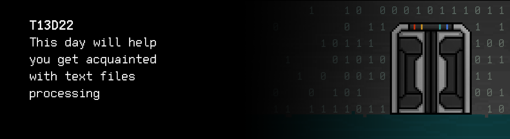
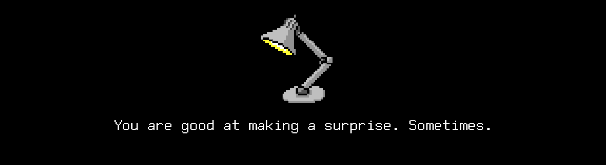

# T13D22

Foydali video ma’lumotlarni Platformadagi “Loyihalar (Media)” bo‘limida topishing mumkin.

## Contents

1. [Chapter I](#lhapter-i) \
 1.1. [Level 4. Room 1.](#level-4-room-1)
2. [Chapter II](#lhapter-ii) \
 2.1. [List 1.](#list-1) \
 2.2. [List 2.](#list-2)
3. [Chapter III](#chapter-iii) \
 3.1. [Quest 1. Open and read.](#quest-1-open-and-read) \
 3.2. [Quest 2. Write your story.](#quest-2-write-your-story) \
 3.3. [Quest 3. Encrypt.](#quest-3-encrypt) \
 3.4. [Quest 4*. Encrypt harder.](#quest-4-encrypt-harder) \
 3.5. [Quest 5. Log everything.](#quest-5-log-everything)
4. [Chapter IV](#chapter-iv)

# Chapter I

## Level 4. Room 1.

***LOADING Level 4…*** \
***LOADING Room 1…***

Mana, tanish xonadasan. Buni eplading. SI chiqa olganingdan norozi ekani aniq.
Zaldan chiqqach nafasingni rostlab, atrofga qarayapsan. Hammasi har doimgiday - ĸompyuter, stol, lampa, varaqlar. To‘satdan kompyuter ekranida kursor harakatlana boshlaganini payqading.

\> *Yaqinroq kel*

    «Inson», zaifliklaring cheki yo‘q. Lekin hayron qoldirishni
    bilasan-da.Gohida. Ammo chiqishni topaman deb umid qilma.

\> *Ctrl+C*

Qaysidir maʼnoda o‘zing qurgan aqlsiz mashinani to‘xtatding. SI ga yordam berish bundan-da befoyda. G‘azab o‘tida va qo‘lingdan hech narsa kelmaslik hissidan stolga urgach, beixtiyor og‘riq sezmaganingni payqading. Dinamiklardan eshitilgan ovoz fikr-mulohazalaringni to‘xtatdi:

>«Inson», chakki emas. Lekin bu mening labirintim, mening hududim va sen mening asirimsan.

\> *ps -a*

    PID TTY          TIME CMD
    8 tty1     00:00:00 bash
    65 tty1     00:00:00 ps
    98 tty1     99:99:99 ai

>Urunishlaring behuda. Men baribir chiqaman, sen esa

\> *kill 98*

This will stop it for a while. 

\> *rm -rf ./src*

    rm: cannot remove ‘./src’: Permission denied

\> *sudo rm -rf ./src*

    rm: cannot remove ‘./src’: Permission denied

To‘g‘ri, aks holda bu juda oson bo‘lardi. \
Stol ustidagi kompyuterning o‘ng tomonidagi eski, sarg‘aygan varaqlarga qarab, qandaydir g‘oya yoki fikr topish umidida ularni titkilashga tushding.

\> *Ustki varaqni olish*

***LOADING…***

# Chapter II

## List 1.

Varaq ancha eski, aksariyat so‘zlarni o‘qib bo‘lmaydi. Pastda deyarli o‘chib ketgan pechat bor.

\> *Ko‘z yugurtirib chiqish*

>Loyiha shunᅠᅠ mala. Hisobot № 1ᅠ3. \
>Tayyorlangan: Bosh injener B.ᅠᅠᅠᅠᅠᅠs
>
>Yigirmaᅠᅠ chi ᅠᅠᅠᅠkun, hammasi reja bo‘yicha ketyapti.
>Barcha tajribali o‘qim. Biroq kety
>
>Boshidan mo‘ljalanganiday, bu jarayon natijada katta ehtimollik bilan global muaaaam mavjud bo‘lgan yo‘l bilan hal qilish va tuzilgan hamda ekspluatatsiyasi davomida paydo bo‘lgan kamchiliklarini tuzatishi mumkin.  Bu bosqichning o‘zida uni tushunish va yuqori darajada moslashishga qodir ekanini ko‘r.ᅠᅠᅠᅠ
>
>...
>
>Tavsiya qilinadi: sinovlarni to‘liq davom ettirish, keyinchalik ish yurgizilishi uchun asos solinishiga tayyorgarlik ko‘rish.
>
>Imzo: bosh rahrar MCHJ “р ᅠᅠᅠᅠᅠᅠᅠᅠᅠᅠ е.ᅠᅠᅠᅠᅠ

Bu hisobotda nima haqda gap ketmasin, sen uchun u yerda foydali maʼlumot yoq. Harqalay hozir.

\> *Izlashni davom etish*

***LOADING…***

## List 2.

Ko‘zing «Shifrlash: boshdan oxir» deb nomlangan qog‘ozga tushdi.

\> *Varaqni o’qish*

>… \
>Sezar shifri, siljish shifri deb ham atalgan — eng sodda va keng tarqalgan shifrlash ussullardan biri. Sezar shifri — shifrning bir turi bo‘lib, u yerdagi ochiq maydon ichidagi har bir belgi alifboda undan chap yoki o‘ng tomonda turgan belgiga almashtiriladi. Masalan, o‘ng tomonga 3 ga siljish shifrida, A G ga almashtirilardi, B D ga va hokazo. Shifr Rim imperatori Gay Yuliy Sezar nomi bilan atalgan. U sarkardalari bilan maxfiy yozishmalarda undan foydalangan. \
>Sezar shifri bajaradigan shifrlash qadami ko‘pincha ancha murakkab bo‘lgan Vijener shifri kabi sxemalarning bir qismi sifatida yoqiladi, va haliyam ROT13 tizimida zamonaviy ilovaga ega. \
>…

Maqolani o‘qigach, bitta fikr paydo bo‘ldi. SI ning barcha manbalarini o‘chirib tashlash bo’lmayapti, unda, ehtimol, ularni shifrlab qo‘yish mumkindir, shunda u yana zaif bo‘lib qoladi. Varaqlarga rahmat!
Lekin buning uchun shifrlash dasturini o‘zim yozib, fayllar bilan ishlab ko‘rishim kerak... Eh, vaqt ketyapti. Ishga kirishish kerak.

***LOADING…***

# Chapter III

## Quest 1. Open and read.

\> *Mahalliy omborni yangilash*

Faylni ochib, o‘qishni boshlasa bo‘ladi. Eng yaxshisi, faylda funksiya yaratish kerak,
masalan, src/cipher.c, u yerda o‘qish va matnli faylni terminalga chiqarish mumkin.
Shuningdek, menyu dasturiga 1 bo’limni qo‘shish kerak - faylga yo‘lni ko‘rsatish,
shunda stdin orqali uni ochib, o‘qish mumkin.

***== Quest 1 qabul qilindi. src/cipher.c dastur tuzing. Dasturda terminal menyu tuzib
uning birinchi bo‘limini yarating. Bo‘limda faylni ochish, o‘qish va terminalga
chiqarish uchun stdin ga fayl nomi ko‘rsatilsin.
Agar fayl bo‘sh yoki mavjud bo‘lmasa, yoki qandaydir boshqa xatolik bo‘lsa,
«n/a»ni chiqar. -1 kiritilgan taqtirda dastur o‘z ishini yakunlasin. -1 buyrug‘idan
tashqari boshqa menyu bo‘limlari bajarilgan holda yangi satrga o‘tish sodir
bo‘lsin. Loyiha Makefile yordamida yig‘ilsin. Bosqich nomi - cipher. Bajariladigan
fayl nomi - cipher. Bajariladigan fayl omborning ildizi build papkasida joylashgan
bo‘lishi kerak. dirent.h kutubxonadan d_namlen ni qo‘llash mumkin emas. ==***

| Kiruvchi maʼlumotlar | Chiquvchi maʼlumotlar | Fayl |
| ------ | ------ | ------|
| 1 text.txt -1 | Aloha!  | Aloha! |
| 1 abc.txt 1 abc.txt -1 | Hihi_haha  Hihi_haha   | Hihi_haha`\n` |
| 1 doesnt_exist.t_x_t 1 love.txt -1 | n/a i_love_sh21  | i_love_sh21 |

> Vazifani yuborishdan avval, ekranda keraksiz yozuvlar chiqmayotganiga ishonch hosil qil. Faqat vazifaning javobi bo‘lishi kerak.

***LOADING...***

> UNUTMA! Barcha dasturlar stil normasi va xotira sizib chiqishiga tekshiriladi. Matnlarni boshlash bo‘yicha ko‘rsatmalar xuddi o‘sha `materials` papkasida joylashgan.

## Quest 2. Write your story.

Zo‘r, o‘qish tugadi.
Endi faylga yozish bilan mashq qilib ko‘rish kerak. src/cipher.c ga terminaldan matnli maʼlumotni matnli faylga yozish funksiyasini qo‘shsa bo‘ladi, bu yangi satr bo‘ladi. Menyuning 2 bo’limi - matn satrini qabul qilish va yuklangan faylga yozish.

***== Quest 2 qabul qilindi. src/cipher.c dasturga qo‘shimcha kiritish. Menyuga 2 bo’lim qo‘shish - terminaldan matn satrini qabul qilish va 1 bo’limda yuklangan faylning oxiriga uni yozish. Fayldagi maʼlumotni terminalga chiqarish. Agar fayl bo‘sh yoki mavjud bo‘lmasa, yoki qandaydir boshqa xatolik bo‘lsa, «n/a» ni chiqar. -1 kiritilgan taqtirda dastur o‘z ishini yakunlasin. -1 buyrug‘idan tashqari boshqa menyu bo‘limlari bajarilgan holda yangi satrga o‘tish sodir bo‘lsin. 
Loyiha Makefile yordamida yig‘ilsin. Bosqich nomi - cipher. Bajariladigan fayl nomi - cipher. Bajariladigan fayl omborning ildizi build papkasida joylashgan bo‘lishi kerak. dirent.h kutubxonadan d_namlen ni qo‘llash mumkin emas. ==***

| Kiruvchi maʼlumotlar | Chiquvchi maʼlumotlar | Fayl |
| ------ | ------ | ----- |
| 1 test.txt 2 Bek the great -1 | I_love  I_love Bek the great  | I_love`\n` |
| 2 Bek the great -1 | n/a  |  |
| 1 doesnt_exist.txt 2 Wow -1|n/a n/a | ~~doesnt_exist~~ |
| 1 aboba.txt 2 hi -1|n/a hi | ~~empty~~ |

> Vazifani yuborishdan avval, ekranda keraksiz yozuvlar chiqmayotganiga amin bo’l. Faqat vazifaning javobi bo‘lishi kerak.

***LOADING...***

## Quest 3. Encrypt.

Endi, matnli fayllarni o‘qish va yozish tugaganda, SI ning manbalarini shifrlash
jarayoniga o‘tsa bo‘ladi.

src/cipher.c ga fayllarni qayta ishlash funksiyasini qo‘shish kerak, u belgilangan katalogdagi (bu vaziyatda - /src/ai_modules) barcha .с fayllarni o‘qib, Sezar kodi bilan
shifrlaydi, .h fayllarini esa to‘liq tozalab, bo‘sh saqlaydi. Bu harakatni menyuga 3 bo’lim deb chiqarish. Raqam shaklida siljitishga ruxsat berish.
Barcha o‘zgartirilgan fayllarni va src/cipher.c ni keyin omborda dastlabkilariga almashtirib, saqlash kerak. Kalitni unutmang, bu modullardan baʼzilari kelajakda to‘satdan kerak bo‘lib qolishi mumkin.

***== Quest 3 qabul qilindi. src/cipher.c dasturiga qo‘shimchalar kiritish. Menyuga 3 bo’limni qo‘shish - fayllarining barchasini Sezar kodi bilan shifrlash va belgilangan katalogdagi barcha .h fayllarni tozalash. Sezar kodi uchun siljish ham terminal orqali parametr sifatida belgilanadi. Barcha o‘zgartirilgan fayllarni va src/cipher.c omborda dastlabkilariga almashtirib, saqlash kerak. Loyiha Makefile yordamida yig‘ilsin. Bosqich nomi - cipher. Bajariladigan fayl nomi - cipher. Bajariladigan fayl omborning ildizi build papkasida joylashgan bo‘lishi kerak. dirent.h kutubxonadan d_namlen ni qo‘llash mumkin emas. ==***

> Ushbu vazifa avtromat tarzda sinov tizimi orqali qayta ishlanmaydi.

***LOADING...***

## Quest 4*. Encrypt harder.

SI ning modullarini shifrlab bo‘lgach, Sezar shifri judayam oson deb tashvishlana boshlading. SI uni osonlikcha buzishi mumkin. Qiyinroq algoritmni qo‘llash imkoni bo‘lganida edi... Masalan, DES. Hech bo‘lmasa, urinib ko‘rish arziydi. Agar o‘xshamasa, hechqisi yo‘q, Sezar muhim fayllarni allaqachon himoyalab qo‘ydi. Ishga tushirishni 4 bo’limga chiqarish.

***== Quest 4 qabul qilindi. src/cipher.c dasturiga qo‘shimchalar kiritish. Menyuga 4 bo’limni qo‘shish - .c fayllarning barchasini DES algoritmi bilan shifrlash va belgilangan katalogdagi barcha .h fayllarini tozalash. Loyiha Makefile yordamida yig‘ilsin. Bosqich nomi - cipher. Bajariladigan fayl nomi - cipher. Bajariladigan fayl omborning ildizi build papkasida joylashgan bo‘lishi kerak. dirent.h kutubxonadan d_namlen ni qo‘llash mumkin emas. ==***

> Ushbu vazifa avtromat tarzda sinov tizimi orqali qayta ishlanmaydi.

***LOADING...***

## Quest 5. Log everything.

Hamma manbalar shifrlandi va saqlandi, orqaga yo‘l yo‘q. Davom ettirishdan oldin, o‘ylanib qolding, dasturlaring bajarayotgan harakatlarni faylga yozib qo‘ysa yaxshi bo‘lardi. Axir xotirang pand berishi mumkin. Buning ustiga, otladka va sinovdan o‘tkazish jarayonlarini osonlashtiradi hamda keyinchalik bu yozuvlarga yana qaytib, dastur ishlayotganda yuz bergan baʼzi kamchiliklarni tushuna olasan. Menimcha, bu jurnallashtirish yoki loginlashtirish deb nomlanadi.

Loginlashtirishni alohida modul yordamida belgilab qo‘yish mumkin, keyinchalik uni sarlavhali fayl yordamida o‘z dasturlaringga qo‘sha olasan. src/logger.c va src/logger.h fayllarini yaratish mantiqqa to’g’ri. Ularga quyidagi funksiyalarni qo‘shsa bo‘ladi:

`FILE* log_init(char *filename);`

`int logcat(FILE* log_file, char *message, log_level level);`

`int log_close(FILE* log_file);`

 Ular bu nom bilan log faylini yaratadi, yuborilgan xabarni yaratilgan log fayliga yozadi va uni yopadi. Xabar shakli - loginlashtirish darajasining belgisi (DEBUG, INFO, WARNING, ERROR), vaqti va xabarning o‘zi.

Sinovdan o‘tkazish uchun logga asosiy harakatlarni yozish maqsadida bundan oldin ishlab chiqilgan src/cipher.c shifrlash dasturiga loginlashtirishni qo‘shsa bo‘ladi. Barcha o‘zgarishlarni omborga kiritishni unutma!

***== Quest 5 olindi. Logerni ishlatish uchun src/logger.c va src/logger.h fayllar yaratilsin. U yerga log_init, logcat va log_close funksiyalarini qo’shsa bo’ladi, ular ushbu nom bilan log faylini yaratadi, yuborilgan xabarni yaratilgan log fayliga yozadi va uni yopadi. Xabar shakli - loginlashtirish darajasining belgisi (DEBUG, INFO, WARNING, ERROR), vaqti va xabarning o‘zi. \
src/cipher.c dasturiga qo‘shimchalar kiritish, unga yozilgan loggerni qo‘shish, u (Fayl «aaa.c» ochiq, «bbb.h» fayiliga satr yozilgan va hokazo) dasturlarining asosiy harakatlarini faylga yozadi. Loyiha Makefile yordamida yig‘ilsin. Bosqich nomi - cipher. Bajariladigan fayl nomi - cipher. Bajariladigan fayl omborning ildizi build papkasida joylashgan bo‘lishi kerak. dirent.h kutubxonadan d_namlen ni qo‘llash mumkin emas. ==***

> Ushbu vazifa avtromat tarzda sinov tizimi orqali qayta ishlanmaydi.

***LOADING...***

# Chapter IV

Hamma o‘zgarishlarni saqlashing bilan, kompyuter ekrani o‘chib qoldi. Bir necha soniyadan keyin xonadagi bittagina lyuminessens lampasi ham o‘chdi, yana qorong‘ida qolding. Faqat eshik ortidagi ingichka yorug‘lik nuri yuzingni yorityapti, xolos.

«Bu nima? SI nimadir qilib butun xonani chiroqsiz qoldirdimi? U qo‘rqayotgan bo‘lsa kerak. U buni his qilishga qodir bo‘lsa, albatta. Umid qilamanki, to‘g‘ri yo‘ldan ketyapman»,- deb o‘ylading.

\> *Eshik yoniga bor*

Eshik ochiq ekan. Menimcha, elektr quvvati o‘chganda, uni yopib turgan mexanizm ham ishlamay qoldi.

«Xo‘sh, unda, keyingi xonada ishni davom ettiramiz. Bu temir-tersak mendan shunchaki qochib qutilolmaydi».

\> *Eshikni och*

Endi butun xona yop-yorug‘. Ko‘p o‘ylamay, ostonani hatlab o‘tding va yangi xonaga qadam qo’yding.

***LOADING...***

