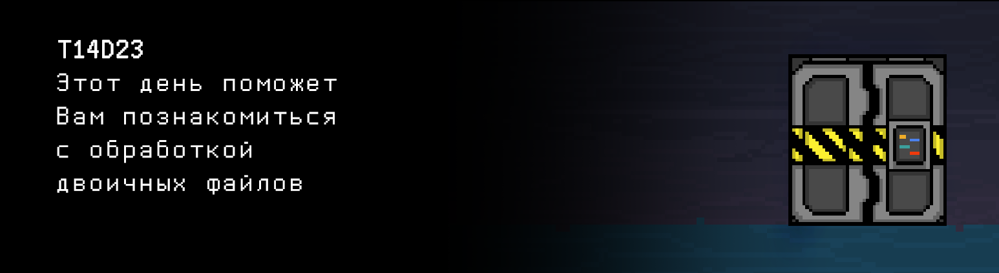

# T14D23

Foydali video materiallarni Platformadagi "Projects (Media)" bo‘limida topishingiz mumkin.

## Contents

1. [Chapter I](#chapter-i) \
 1.1. [Level 4. Room 2.](#level-4-room-2)
2. [Chapter II](#chapter-ii) \
 2.1. [Quest 1. Back to sort.](#quest-1-back-to-sort) \
 2.2. [Quest 2. And search.](#quest-2-and-search) \
 2.3. [Quest 3. Clear data.](#quest-3-clear-data)
3. [Chapter III](#chapter-iii)

# Chapter I

## Level 4. Room 2.

***LOADING Level 4…*** \
***LOADING Room 2…***

Menimcha, kechagi honadagi ish samarali bo’ldi. Hozircha SI ko’rinmayapti – dinamik jim va terminal bo’sh. O’tib ketish varianti bor, SI ning o’zi bu yerda bosh qotirsin.

\> *Eshikni ochish*

Yopiq. Boshqa variant yoq.

\> *Terminalga qarash*

    Eshik datasets/door_state fayl nosozligi tufayli ochib bo‘lmaydi.
    Diqqat! Fayldagi yozuvlar o’sish tartibida saralansin.
    Ma’lumot faylda butun sonli maydonlar bilan ketma-ket yozilgan tuzilmalar shaklida  saqlanadi:
    yil, oy, kun, soat, daqiqa, soniya, status (0/1), kod.

    Xabar avtomatik ravishda yaratildi. Bunga javob berishga urinmang.

***LOADING...***

# Chapter II

## Quest 1. Back to sort.

\> *Yozuvlarni tartiblash – bu oson*

`datasets/door_state` fayli ancha hajmli ekan. Bunday yozuvlarni operativ xotiraga butunlayin yuklash mumkin emas, ayniqsa bu eski terminallarda. Tartiblash butun faylni opertiv xotiraga to'g'ridan-to'g'ri diskdagi fayl bo'yicha yuklamasdan amalga oshirilishi kerak. Operativ xotiraga birdaniga faqat bir nechta yozuvni yuklash mumkin. Tartiblash uchun dasurning o'zi `src/state_sort.c` da joylashsin. Test qilish uchun faylga bo'lgan yo'l, fayldagi ma'lumotlar ekranga chiqarilsin, yozuvlarni qo'shish belgilari oldindan ko'zlab qo'yilsin.

\> *Bu esa uncha osonmas..*

***== Quest 1 qabul qilindi. src/state_sort.c dasturini yaratish, u datasets/door_state_1 binar faylida yozuvlarni sana va vaqt boʻyicha oʻsish tartibida tartiblaydi. Faylning o'zi butunsonli maydonlari bo'lgan tuzilmalar massividan iborat: yil, oy, kun, soat, daqiqa, soniya, holat (0/1), kod. Dastur faylga yo'lni qabul qilishi kerak. Shuningdek, menyu amalga oshirilishi kerak, bu erda 0 bosqich - fayldagi ma'lumotlar konsolga chiqadi, 1 bosqich - fayldagi ma'lumotlar tartiblanadi va ekranga chiqadi, 2 bosqich - yozuv qo'shiladi, tartiblanadi va ekranga chiqadi. Bir vaqtning o'zida butun faylni xotiraga yuklash mumkin emas. Mavhumlikni ko'rib chiqish, binar fayli - diskdagi massiv. Ushbu abstraktsiya uchun yordamchi funksiyalarni ishlab chiqish. Agar kirish fayli bo'sh bo'lsa yoki biron bir xatolik yuzaga kelsa, n/a chiqarilsin. Loyihani yig'ish Makefile yordamida bajarilishi kerak. Bosqich nomi - state_sort. Bajarilgan fayl nomi - Quest_1. Bajarilgan fayl build papkasidagi omborning ildizida joylashishi kerak. ==***

| Kiruvchi ma’lumotlar | Chiquvchi ma’lumotlar |
| ----- | ----- |
| datasets/door_state_1 0| 2020 9 1 12 0 0 0 153 2020 3 25 19 37 56 1 951 2020 4 3 1 53 26 1 393 ...  1991 6 28 10 50 57 0 732 1924 11 22 2 24 10 1 398 |
| datasets/door_state_1 1| 1920 2 24 7 39 14 0 112 1920 4 26 0 32 33 0 926 1920 7 5 18 8 7 1 216 ...  2020 5 30 16 51 40 1 147 2020 9 1 12 0 0 0 153 |
| datasets/door_state_1 2 2020 12 21 23 54 26 1 768| 1920 2 24 7 39 14 0 112 1920 4 26 0 32 33 0 926 1920 7 5 18 8 7 1 216 ...  2020 5 30 16 51 40 1 147 2020 9 1 12 0 0 0 153 2020 12 21 23 54 26 1 768 |

> Vazifani yuborishdan oldin, ekranda keraksiz yozuvlar chiqmayotganiga ishonch hosil qiling. Faqat vazifa javobi bo'lishi kerak.

***LOADING...***

## Quest 2. And search.

> UNUTMANG! Sizning barcha dasturlaringiz kod uslub normasi va xotira sarfi uchun tekshiriladi. Testlarni ishga tushirish bo'yicha ko'rsatmalar ham `materials` papkasida joylashgan. 

Fayl tartiblandi.

\> *Eshikni ochish*

Haliyam yopiq.

\> *Nima bo’lyapti o’zi, bunday o’tib bo’lmaydi...*

 Buyruq o’tmadi.

\> *Terminalga qarash*

Terminalda shunday matn yozilgan:
    
    Kirish mumkinligini tekshirish uchun 0*.**.**_& kodni belgilang.

\> *Menimcha, fayl bo’yicha izlash kerak*

Aynan. Va matnga asoslanib, sizga sana bo'yicha, «KK.OO.YYYY» formatida kerak. Ishlab chiqilgan dasturni src/state_search.c da saqlash kerak. Faylga yo'lni kiritish va sana bo'yicha qidirish satrini ta'minlash. Hali ham butun faylni xotiraga yoklash arzimaydi.

***== Quest 2 qabul qilindi. Binar faylda sana bo'yicha «KK.OO.YYYY» formatida qidiradigan src/state_search.c dasturni yaratish. Ishga tushganda, dastur faylga yo'lni va sana bilan qidirish satrini qabul qilishi kerak. Butun faylni xotiraga yuklash mumkin emas. Topilgan birinchi kodni konsolga chiqarish. Agar kirish fayli bo'sh bo'lsa yoki biron bir xatolik yuzaga kelsa, n/a chiqarilsin. Loyihani yig'ish Makefile yordamida bajarilishi kerak. Bosqich nomi - state_search. Bajarilgan fayl nomi - Quest_2. Bajarilgan fayl build papkasidagi omborning ildizida joylashishi kerak. ==***

| Kiruvchi ma’lumotlar | Chiquvchi ma’lumotlar |
| ----- | ----- |
| datasets/door_state_2 01.09.2020 | 153 |

***LOADING...***

## Quest 3. Clear data.

\> *Tayyor. Kodni kiritish*

Muvaffaqiyat bilan tekshirildi! Lekin eshik yopiq.

\> *Nima?*

Yopiq.

\> *Terminalga qarash*

    2020 yil martdan maygacha ma’lumotlar bilan nosozlik. 
    Bu nosozlikni muhim bo’lmagan ma’lumotlarni o’chirish orqali hal qil.

Mayli, fayldan uning o’lchami mos kamaytirish bilan «KK.OO.YYYY» formatida belgilangan chegaralar bo'yicha ma'lumotlarni tozalash dasturini ham qo'shamiz. U src/clear_state.c da joylashishi kerak. Test qilish uchun faylga yo'lni ko'rsatishni tayyorlash. Hali ham butun faylni xotiraga yuklab bo’lmaydi. Biz mahalliy terminallarni butunlay sindirmoqchi emasmiz-ku. Yoki...

***== Quest 3 qabul qilindi. Ma’lumotlar fayilda ma'lum bir vaqt oralig'ida hajmi mos ravishda kamaytirish bilan o'chirishini amalga oshiradigan src/clear_state.c dasturini yaratish. Ishga tushganda, dastur faylga yo'lni va «KK.OO.YYYY KK.OO.YYYY» formatidagi vaqt oralig’ini qabul qilishi kerak, ikkala sana ham kiradi. Agar kirish fayli bo'sh bo'lsa yoki biron bir xatolik yuzaga kelsa, n/a chiqarilsin. Loyihani yig'ish Makefile yordamida bajarilishi kerak. Bosqich nomi - clear_state. Bajarilgan fayl nomi - Quest_3. Bajarilgan fayl build papkasidagi omborning ildizida joylashishi kerak. ==***

| Kiruvchi ma’lumotlar | Chiquvchi ma’lumotlar |
| ----- | ----- |
| datasets/door_state_3 21.09.1945 18.10.1945 | 1920 2 24 7 39 14 0 112 1920 4 26 0 32 33 0 926 1920 7 5 18 8 7 1 216 ...  2020 5 30 16 51 40 1 147 2020 9 1 12 0 0 0 153 |

***LOADING...***

# Chapter III

Muammo hal bo’ldi, ma’lumotlar o’chirildi, kod kiritildi. Bu yerdan chiqich kerak, SI kelib qolmasin tag’in.

\> *Eshikni ochish*

U haliyam yopiq qolishiga tayyorsan, lekin bu hali hammasi emas. Eshikni qo‘l uchida ochding. \
Tezlashish kerak, SI paydo bo’lib qoladi!

\> *Ure. Hademay maqsadga erishdik.*

Biz kim? Bitta shaxsni ko’pday qabul qilyapsizmi?

\> *Bo’ldi, men ketdim.*

***LOADING...***
