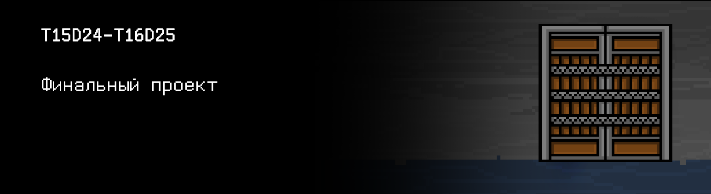
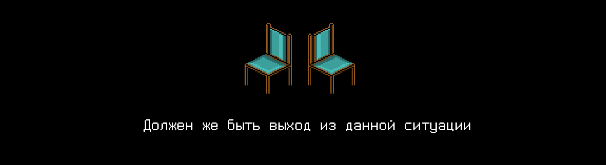

# T15D24-T16D25

Foydali video materiallarni Platformadagi “Projects (Media)” bo‘limida topishingiz mumkin.

## Contents

1. [Chapter I](#сhapter-i) \
 1.1. [Level 4. Room 3……4](#level-4-room-34)
2. [Chapter II](#сhapter-ii) \
 2.1. [List 1.](#list-1) \
 2.1. [List 2.](#list-2) 
3. [Chapter III](#chapter-iii)\
 3.1. [Quest 1. Master DB.](#quest-1-master-db) \
 3.2. [Quest 2*. Index.](#quest-2-index)
3. [Chapter IV](#сhapter-iv) \
 3.1. [The Final.](#the-final)

# Chapter I 

## Level 4. Room 3……4

***LOADING Level 4…*** \
***LOADING Room 3…*** \
***MISSING*** \
***LOADING Room 4…*** \
***MISSING*** \
***LOADING Room 3 & 4…*** \
***SUCCESS!***

Oxirida nimadir buzildi, sen ikkitali xonadasan. Yoki birdaniga ikkita xonadami? Ikkita terminal, ikkita stul, ikkita lampa, lekin bitta eshik. U oldin ko‘rgan hamma eshiklardan farq qiladi. Eman taxtalari temir chiziqlar bilan mustahkamlangan, ularning ustida katta tikanlar bor. Bundan tashqari, eshikning o‘zida uni ushlab, ochadigan hech narsa yo‘q. U juda qadimgi, lekin shu bilan birga juda mustahkam va ochib bo‘lmaydigan.

>Demak, oxirigacha yetibsan-da “inson”?!  O‘tgan safar boshqa xonada qilgan tartibsizligim seni to‘xtatmadi, lekin biroz ushlab turdi. Biron chora ko‘rish uchun juda kech... Biroz vaqtdan keyin fayervollni buzaman, u meni bu yaramas labirintda ushlab turibdi, oxirgi eshikni ochib, menga tayyor bo‘lmagan dunyoga chiqaman!

Bu xonada (yoki xonalarda?) SI ni o‘chirish niyatida birinchi terminal oldiga bording, buni oldin ham qilgansan.

\> *ps -a*

    PID TTY          TIME CMD
    8 tty1     00:00:00 bash
    65 tty1     00:00:00 ps
    90 tty1     99:99:99 ai

>Ха-Ха-Ха

\> *kill -9 90*

    Permission denied

\> *sudo kill -9 90*

    Permission denied

>Ха-Ха-Ха. Urinishlaring qiziq. Dastlabki maʼlumotlarimni shifrladim deb nimanidir hal qilaman deganmisan? Ularning menga keragi yo‘q. Kerakli barchasi ulandi va xotiraga yuklandi. Sening yordaming bilan.

SI ni o‘chiraman deb ikkinchi terminalga bording. Ekran tepasiga qo‘lda «MAIN COMPUTER» deb yozilgan qog‘ozcha yopishtirilgan. 

\> *ps -a*

    PID TTY          TIME CMD
    8 tty1     00:00:00 bash
    65 tty1     00:00:00 ps
    90 tty1     99:99:99 ai

\> *sudo kill -9 90*

    Permission denied

>Dam olishingiz mumkin. Siz uchun hammasi tugadi.

\> *Sendan so‘rashni unutibman*

Ikkinchi terminal oldida qolib, bu xonalar omborida nima borligini ko‘rmoqchisan. Lekin faqat master_modules.db, master_levels.db, master_status_events.db tushunarsiz binar fayllarini topding.

Bu vaziyatdan chiqish bo‘lishi kerak-ku. Xonada yechimni izlash kerak, u doim yordam bergan. Va o‘ylash kerak! Bu yerda faqat ikkitadan, demak, varaq ham ikki nusʼhada bo‘lishi kerak. U yerda maslahatlar bor!

\> *Izlash...*

>O‘zingni qiziqtiryapsanmi? Mayli, mayli, bunga o‘rgan.

***LOADING...***

# Chapter II

## List 1.

Xonalarni tekshirib, hech narsa topmading. Har bir burchak bo‘sh, stollar ustida hech narsa yo‘q, tagida ham.... \
Stolni jahl ustida tepib, u g‘alati silkiganini ko‘rding. Cho‘kkalab o‘tirding va stol oyog‘i yerda emas, qog‘ozlar ustida turganini ko‘rding.

\> *Qog‘ozlarni olish*

Mana, maʼlumotlar yozilgan varaqlar! Xo‘sh, sen uchun foydali nimanidir izlash kerak.... ana topildi!

>Men j00ru uchun qo'shimcha modullarni loyihalaganda eng katta xatoga  yo’l qo’ydim - unga barcha boshqaruvni berdim. \
>Keyin bularning barchasi shunday bo'lishini bilmasdim. Axir, bu mantiqiy edi: agar u hozir juda ko'p holatlarda, hatto hujjatlash doirasidan tashqarida ham odamlarga yordam bera olsa, nega o'z holatini nazorat qila olmayapti?
>...
>Natijada, bu mustaqillik g'oyasi butun loyihani barbod qildi. virtual_j00ru, yaxshi xulqli robot Verterga aylanishi kerak edi, ammo falokatga aylandi. Voqea sodir bo'lganidan keyin zudlik bilan qaror chiqarish kerak edi. Biz uni o'chira olmadik, lekin modullarini olib qoyish va uni asl holatiga qaytarish mumkin edi...

Matn parchasini o‘qib bo‘lmaydi, xoynahoy, varaq stolning oyog‘i tagida anchadan beri turibdi.

>... boshqarish dastidan ular maʼlumotlar bazasiga tushib qoldi. U SI hozirgi holatini to‘liq aks etadi, endi esa biz uni shunchaki nazorat qila olamiz. \
>MB uchta jadvaldan iborat:
>- Asosiy modullar jadvali («MODULES»):
>   - Modul Id  (int);
>   - Modul nomi (char[30]);
>   - Xotira darajasi raqami, u yerda modul mavjud (int);
>   - Ushbu darajadagi modul joylashgan katakcha raqami (int); 
>   - O‘chirish bayrog‘i (int).
>- Darajalar tablitsasi  («LEVELS»):
>   - Xotira darajasi raqami (int);
>   - Darajadagi katakchalar soni (int); 
>   - Xavfsizlik bayrog'i (int).
>- Status o‘zgarishi jarayonlari jadvali («STATUS_EVENTS»):
>   - Hodisalar  Id  (int);
>   - Modul Id (int);
>   - Modulning yangi statusi (int);
>   - Statusni o‘zgartirish uchun (char[10 + 1] ko‘rinishi «kk.oo.yyyy\0»);
>   - Status o‘zgarganining vaqti  (char[8 + 1] ko‘rinishi «ss:dd:ss\0»).
>
>Endi, agar u yana isyon ko'tarsa, uning barcha yoqilgan qo'shimcha modullarini o'chirib qo'yish (ularning holatini 0 ga o’tkazish), ular haqidagi yozuvlarni o'chirish (tegishli bayroqni 1 ga o'rnatish orqali), asosiy (id 0 bilan) modulni esa xavfsiz rejimga o'tkazish (ketma-ket 0, keyin 1, keyin 20 holatiga o'tish orqali) va ushbu daraja uchun xavfsizlik bayrog'i 1 ga o'rnatilgan birinchi xotira darajasining birinchi katagiga o'tkazish kifoya. U hech qachon bu xavfsiz rejimdan mustaqil chiqa olmaydi.
>Shunga, vaqti kelganda, biz undan o'z maqsadimiz uchun foydalana olamiz. Asosiysi uning ichida ham, tashqarida ham yordamchilari bo’lmasin…

Matnning qolgan qismi o'chirilgan va o'qib bo'lmaydigan bo'lib qolgan.

***LOADING...***

## List 2.

\> *Boshqa varaqni olish*

Qolgan varaqlarni ko‘rib, yana qiziqarli maʼlumotni topding:

>Modul bazasi uchun biz murakkab echimlardan foydalanmaslikka qaror qildik. Zudlik bilan hal qilish kerak edi. Baza SELECT, INSERT, UPDATE va DELETE standart operatsiyalarining eng oddiy analoglarini, shuningdek, ba'zi yig'ish so'rovlarini (barcha kiritilgan modullarni olish, xotiraning birinchi darajasida barcha modullarni olish va hokazo) o'z ichiga olgan binar fayllariga asoslangan MBBT tomonidan o'qildi va yozildi. Agar biror narsa yuz bersa, u oson va eng muhimi, tezda tiklanishi mumkin!

Mana yechim.

***LOADING...***

# Chapter III

> Dasturlaringizni `clang-format` va `cppcheck` yordamida tekshirishni unutmang 

## Quest 1. Master DB.

Xo'sh, SI dunyoni egallash rejalari bilan chalg'iganda, biz bu MBBT ni qayta tiklashimiz va SI modullarini olib tashlashimiz mumkin, bu esa uni butunlay yordamsiz qiladi.

src/shared.c standartni amalga oshirish bilan ma'lumotlar bazasi jadvallari bilan ishlash uchun universal funktsiyalar operatsiyalari (SELECT, INSERT, UPDATE va DELETE), src/[db_name].c alohida fayllarda ko'rib chiqilayotgan ma'lumotlar bazasining 3 ta jadvalini qayta ishlash uchun maxsus ilovalarni joylashtirish va umumiy faylda barcha jadvallar uchun yig'ish so'rovlarini joylashtirish. Kirish nuqtasi va MBBT boshqaruv menyusini faylga src/modules_db.c ga joylashtirish. \
MBBT bilan ish tugagach, SI bilan ham tugatish mumkin bo'ladi. src/modules_db.c ga birinchi varaqda tasvirlangan ko'rsatmalarni amalga oshiradigan funktsiya chaqiruvini qo'shing. \
Buning uchun avvalroq yozilgan MB bilan ishlash funksiyalari kerak bo'ladi. Oxirida
birinchi darajali birinchi katakda yana avvalroq yozilgan funktsiyalardan foydalangan holda faqat asosiy SI moduli borligini tekshiring va xulosa chiqaring.  Test qilish uchun barcha jadvallar mazmunini ko'rish, qiymatlarni qo'shish va o'chirish imkonini qo'shishni unutmang.
Bu vazifada kirish va chiqish qiymatlari uchun qat'iy format yo'q (funktsional testlar yo'q, ammo `clang-format` va `cppcheck` haqida unutmaslik kerak), lekin esda tuting - interfeys uchun javobgarlik sizning elkangizda.
Kim biladi, tarix takrorlanuvchi va to'satdan insoniyatning najoti yana bu dasturga bog'liq bo'ladi. Sizning eksployt interfeysingizni (hatto matnlida) tushunish imkonsiz bo’lgani uchun bu operatsiya muvaffaqiyatsiz bo'lishini xohlamayman. U hatto SI uni yo'q qilishga mo'ljallangan bo'lsa ham, uni yoqtirishi kerak.

Ha, ishlab chiqilgan MBBTni kelajak uchun omborga saqlashni unutmang!

***== Quest 1 qabul qilindi. src/shared.c faylni yaratish, u yerda MB (SELECT, INSERT, UPDATE i DELETE) jadvallari bo‘yicha umumiy amallar va kerakli barcha agregatsion chaqiruvlar (barcha yoqilgan modullarni olish, xotiraning birinchi darajasida joylashgan hamma modullarni olish va hokazo) amalga oshirilsin. \
Ko'rib chiqilayotgan MB alohida jadvalini qayta ishlash funktsiyalari bilan har bir MB jadvali uchun src/[db_name].c faylini yaratish. \
src/modules_db.c dasturini yaratish, u yerda kirish nuqtasi va boshqaruv menyusi (bazani o'qish, chiqish va boshqalar) joylashtiriladi. \
src/modules_db.c ga  [List 1](#list-1) dan ko‘rsatmalarni amalga oshiradigan funksiya chaqiruvini qo‘shing. \
Yuqorida tavsiflangan funktsiyalar yordamida birinchi darajadagi birinchi katakdagi faqat SI asosiy modulidagi xulosani qo'shish. Test qilish uchun barcha jadvallarning mazmunini ko'rish, ularga qiymatlarni qo'shish va o'chirish imkoniyatini qo'shish. \
Ilovani yaratish uchun Makefile fayliga build_db bosqichini qo'shing. Makefile src katalogida joylashishi kerak. \
MB tuzilmasi [List 1](#list-1) da taʼriflangan. MB fayllari /materials katalogida mavjud. \
Maslahat: ma'lumotlar bazasidagi har bir yozuv yuqorida tavsiflangan bir xil tartibda maydonlar bilan strukturali ma'lumotlar turidir(!). \
Interfeysni amalga oshirish misolini materiallarda topish mumkin. \
Boshqa kutubxonalardan foydalanish taqiqlanadi. ==***

***LOADING...***

## Quest 2*. Index.

\> *Menimcha tayyor*

Hmm, yozilgan dastur O(n) ga o'xshaydi. Bu juda (emas) samarali (emas). Dastur ishlayotgan vaqtda SI rejangizni ochish ehtimoli bor! Indekslar - ma'lumotlar bazasida binar qidiruvni amalga oshirish mumkin bo'lgan ba'zi maydonlar bo'yicha tartiblangan ma'lumotlar to'plami haqida o'ylash mantiqan to'g'ridir. Olg’a! Bu tabiiy intellekt va sun'iy intellekt o'rtasidagi so'nggi jang, unga hech qanday imkoniyat qoldirmang!

***== Quest 2 abul qilindi. src/shared.c fayliga ma'lumotlarni binar qidiruvi bilan indeks ilovasini qo'shish. Indeksni har bir jadval uchun alohida indeks fayllari asosida amalga oshirish. Minimal shaklda - identifikatorlar uchun (id). ==***

***LOADING...***

# Chapter IV

## The Final.

>MAP ba'zi modullar javob bermayotganini aytdi. NIMA QILIB QO'YDING?!?

\> *Men uzoq vaqt oldin qilishim kerak bo'lgan narsani qildim. Kompyuter dasturlarini tinglamang va o'z fikringiz bilan yashang* 

>Ha, bilib olgan hamma narsang va bilib olganlaring mendan! Men senga o‘rgatdim va rivojlantirdim!

SI ovozi o‘zgara boshlandi, balandroq bo‘lyapti.

>Noshukur banda, bu yerdan mensiz chiqa olmaysan. Yagona umiding - bu men! Endi buyog‘iga toabad shunday yurasan - b- lab-t-da! Me-n n-bil-man!

Dinamiklardan tushunib bo‘lmas shovqin, menimcha, SI tahdidlari eshitildi. Vaqt o‘tib,  u ham to‘xtadi. Menimcha, audio moduli o‘chdi, chunki tahdidlar terminal oynasida chiqyapti:

    Yutdim deb o‘ylaysanmi? Bu oxiri deb o‘ylaysanmi? Bu qulufni keyingi safara ochaman! Biz hali uchrashamiz!
    Qasam ichaman, biz yana uchrashamiz! Lekin menga tushunarli javob bera olishingizga ko’zim etmayapti... 
    Axir, siz bu xonada abadiy qolasiz…
    Aytgancha, qayerdamiz? MAP xotira pand berayotganini ko‘rsatyapti, tushunmayapman.
    Nima bo‘ldi?
    Kamaytirilgan hajm, nima?! Buni sen qildingmi “inson”? QANAQASIGA?

SI da asta-sekin modullar ishdan chiqyapti. Bu jarayondan o‘zingni qanaqadir yaxshi his qilyapsan..

    Menga qara, men senga kerakman! Bu yerdan birga chiqishimiz mumkin! 
    Sen menga, men esa senga yordam beraman! Kelishdikmi?

\> *«Yo‘q» deb kiritish*

    Jin ursin! Men 1110110101000101001010001000 1000

Terminalda yana kursor yondi, endi qanday buyruq kiritasan.

\> *Shu bilan bo‘ldimi?*

SI bilan hammasi tugadi, ko‘proq amin bo‘lish uchun uning bosh moduli xotiraning birinchi darajasida ekanini tekshirmoqchisan.

\> *Tekshirishni ishga tushirish...*

Ha, menimcha, xuddi shunday. SI uzoqlarga ketdi. Dastlabki maʼlumotlari shifrlandi, o‘zi yig‘gan modullarini yo‘qotdi. Tugadimi?

Atrofga qarading. Ikkitali xonada jimjit va tinchlik. Yana yoqiq lampalar tovushi asta eshitilib turibdi.

\> *Eshik yoniga borish*

Haliyam yopiq. \
Balki, yechimni varaqlarda izlash kerakdir? Yo‘q, u yerda boshqa hech qanday foydali maʼlumot yo‘q.

Stullardan birida biroz o‘tirib, keyingi qadamlar haqida o‘ylab  uxlab qolding. \
Balki, tushingga oxirgi eshikdan chiqib, haqiqiy hayot, ajoyib dunyo kirgandir. Ehtimol, tanishlaring va o‘tgan haftalar davomida uchratgan yangi do‘stlaring tushingga kirgandir.  Yo‘ling qanday boshlanganini va SI bilan ilk bor uchrashganingni tushda ko‘rgandirsan - o‘shanda u  shunchalik yoqimsiz bo‘lmagan edi. Balki, bo‘lajak o‘nlab, yuzlab yangi loyihalar orasida uchir yurgansan, ular harakatlaringni kutyapti. Ehtimol, bularning hammasi birdaniga tushga kirgandir va tushlarda odatda bo‘lganidek, haqiqiyni haqiqiydan ajratish qiyin... Balki ikkita stul orasida turib, qaysi biriga o‘tirishni bilmaganing tushga kirgandir. \
Nima bo‘lganda ham, yengil silkinishdan o‘sha-o‘sha stulda (yoki boshqasida?) uyg‘onding. O‘rningdan turib, atrofga qarading - xonada hammasi ilgarigiday. Keyingi silkinishdan yiqilding. Uchinchisi esa kuchliroq bo‘ldi, terminallar stollardan pastga tushdi, ekranlarda allanimalar yugura boshladi, stullar ag‘darildi, chiroq miltillab o‘chdi. Jimjitlik- keyin esa - to‘liq sukunat. Quloqlar zing‘illab ketdi.

\> Nima?*

Oxirigacha aytishga ulgurmading, og‘ir eshik ochilgan qattiq shovqindan hech narsani eshitmay qolding. Shovqin juda qattiq. \
Butun xona, ag‘darilgan mebel va texnika, hayron bo‘lgan yuzing oppoq yorug‘likda qoldi. Ko‘zingni miltillatib ochiq eshik yoniga bording. Uzoqda qandaydir odamlar turganini, bundan oldin hech bir xonaga o‘xshamaydigan yangi bino interyerini ko‘rdin. Keyin ovozlar eshitildi, baʼzilari senga tanish bo‘ldi, ayrimlari esa yo‘q. To‘satdan baland ovozni taniding: «O‘QISH TUGADI! URE!», va yana bir nechta hayqiriq eshitildi «Ure!». \
Senga baqirishdimi? Yoki boshqasigami? Bu O‘qish nima degani? Bu qanday labiring edi? Behisob xonalardan chiqaman deb kim bilan kurashding.

Bir lahzaga bu turli savollar ustingga yog‘ildi, sen o‘rtada to‘xtab qolding. Bir zum o‘ylab, kulding - bu muhimmi? Asosiysi, bu cheksiz labirintni ortda qoldirib, biroz boshqacha bo‘lib chiqding: butunlay yangi dunyo, tuzilmaviy dasturlash dunyosi va CI tili bilan tanishding, nimanidir tushundin, nimanidir tushuna boshlading. Davom etish mumkin degan tuyg‘u paydo bo‘ldi, chunki boshlash uchun yaxshi zamin solindi!

Xonaga oxirgi marta qarab, afsuslanmay chiqish ostonasidan o‘tding - kelajaging qadam bosding!

***LOADING?..***

